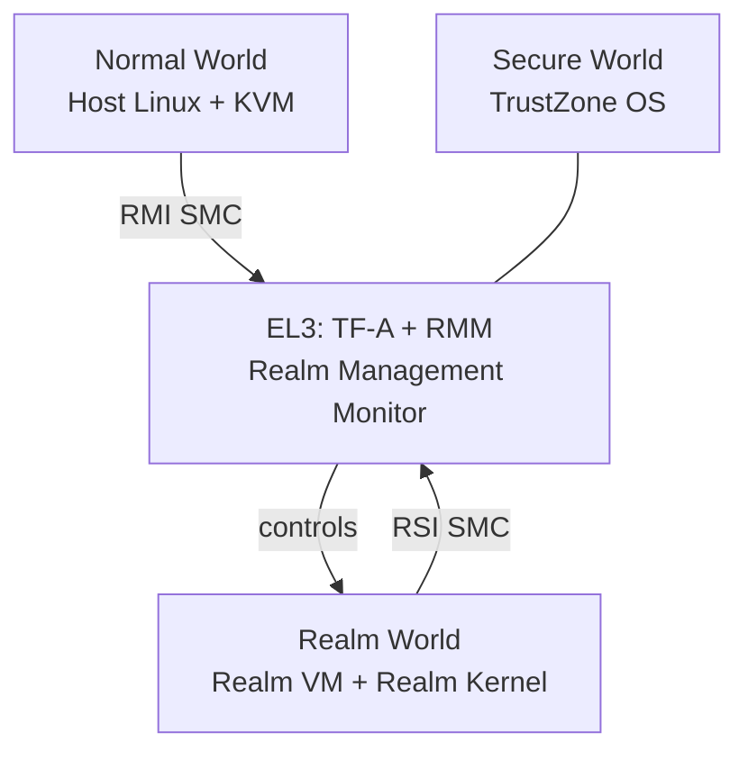

**ARM Confidential Compute Architecture (CCA)** is ARM's hardware TEE for virtual machines, introduced with the ARMv9-A architecture. CCA defines **Realms** — hardware-isolated VMs analogous to Intel TDX's Trust Domains or AMD's SNP guests. CCA is backed by the **Realm Management Extension (RME)** in the hardware and managed by the **Realm Management Monitor (RMM)** — a firmware component running in a new CPU exception level (EL3/Realm World).

## Architecture

| Component | Role |
|---|---|
| **RMM (Realm Management Monitor)** | Firmware at EL3 managing Realm lifecycle; analogous to TDX Module |
| **TF-A (Trusted Firmware-A)** | ARM's reference firmware; hosts the RMM |
| **RMI (Realm Management Interface)** | SMC-based API from Normal World (KVM) to RMM |
| **RSI (Realm Services Interface)** | SMC-based API from Realm VM to RMM |
| **GPC (Granule Protection Check)** | Hardware mechanism enforcing memory ownership per 4KB granule |

## Foundational Work (May 2024 – May 2025)

### ARM CCA in KVM — 2024 Revisions

The KVM host-side CCA series began its public revision cycle in June 2024. Revisions before May 2025:

| Version | Date | Key Focus |
|---|---|---|
| v3 | Jun 2024 | Initial public RFC[^cca-kvm-jun24] |
| v4 | Aug 2024 | VGIC integration, memory management refinements[^cca-kvm-aug24] |
| v5 | Oct/Dec 2024 | RMM v1.x compatibility, pKVM interaction fixes[^cca-kvm-dec24] |

The June 2024 posting (`arm64: Support for ARM CCA in KVM`) established the basic structure: RMI SMC wrappers, Realm creation/destruction, vCPU lifecycle. Review from Marc Zyngier and others drove several architectural changes over successive revisions.

→ Full revision history: [ARM CCA in KVM (patch series)](../entities/patches/arm-cca-kvm.md)

### ARM CCA Guest Support — Running Linux Inside a Realm

A parallel track to the KVM host work: enabling Linux to *run as a guest inside a Realm* (i.e., the in-Realm kernel). This required:

- Detecting that the kernel is running in a Realm (`arm64: Detect if in a Realm and set RIPAS=RAM`) and discovering memory layout via RSI[^cca-guest-may24].
- Populating the IPA (Intermediate Physical Address) space correctly: calling `RSI_IPA_STATE_SET` to accept memory[^cca-guest-jun24].
- Multiple revision rounds through late 2024 as the RSI specification evolved[^cca-guest-aug24][^cca-guest-oct24][^cca-guest-nov24].

This is distinct from the KVM host work — one series makes KVM able to *create* Realms, the other makes a Linux kernel able to *boot inside* one.

### pKVM Protected Guest Support

`Support for running as a pKVM protected guest` (Jul/Aug 2024) — explores running a guest under pKVM (protected KVM, where the host kernel itself is in a restricted privilege mode) with CCA-style memory protection. Two revisions posted in rapid succession[^pkvm-guest].

[^cca-kvm-jun24]: [20240610-arm64-support-for-arm-cca-in-kvm.md](../threads/20240610-arm64-support-for-arm-cca-in-kvm.md)
[^cca-kvm-aug24]: [20240821-arm64-support-for-arm-cca-in-kvm.md](../threads/20240821-arm64-support-for-arm-cca-in-kvm.md)
[^cca-kvm-dec24]: [20241212-arm64-support-for-arm-cca-in-kvm.md](../threads/20241212-arm64-support-for-arm-cca-in-kvm.md)
[^cca-guest-may24]: [20240510-arm64-detect-if-in-a-realm-and-set-ripas-ram.md](../threads/20240510-arm64-detect-if-in-a-realm-and-set-ripas-ram.md)
[^cca-guest-jun24]: [20240605-arm64-support-for-running-as-a-guest-in-arm-cca.md](../threads/20240605-arm64-support-for-running-as-a-guest-in-arm-cca.md)
[^cca-guest-aug24]: [20240819-arm64-support-for-running-as-a-guest-in-arm-cca.md](../threads/20240819-arm64-support-for-running-as-a-guest-in-arm-cca.md)
[^cca-guest-oct24]: [20241004-arm64-support-for-running-as-a-guest-in-arm-cca.md](../threads/20241004-arm64-support-for-running-as-a-guest-in-arm-cca.md)
[^cca-guest-nov24]: [20241017-arm64-support-for-running-as-a-guest-in-arm-cca.md](../threads/20241017-arm64-support-for-running-as-a-guest-in-arm-cca.md)
[^pkvm-guest]: [20240730-support-for-running-as-a-pkvm-protected-guest.md](../threads/20240730-support-for-running-as-a-pkvm-protected-guest.md)

## May 2026 Updates

### ARM CCA in KVM — v14

Steven Price posted v14 (May 13, 107 messages) of the ARM CCA KVM series, rebased on v7.1-rc1 and targeting **RMM v2.0-bet1**[^cca-v14]. Major changes from v13:

| Change | Detail |
|---|---|
| RMI definitions fully updated | All SMC wrappers align with RMM v2.0-bet1; v1.0 compatibility shim dropped |
| Range-based RMI APIs | `RMI_GRANULE_TRACKING_GET` works on ranges, no longer requires alignment to tracking size |
| GIC state via system registers | Replaces the previous memory-based GIC state exchange |
| PSCI completion ioctl removed | KVM now auto-issues `RMI_PSCI_COMPLETE` before re-entering a REC; userspace no longer calls `KVM_ARM_VCPU_RMI_PSCI_COMPLETE` |
| RMI init moved to `arch/arm64/kernel/rmi.c` | Generic RMI init, RMM config, GPT setup, and delegate/undelegate helpers are now outside KVM, enabling non-KVM RMI consumers |
| SRO support moved earlier | Improved mechanism for providing extra memory to RMM; still incomplete pending TF-RMM implementation |
| ARM VM type encoding reworked | Coexists cleanly with pKVM's `KVM_VM_TYPE_ARM_PROTECTED` bit |
| PMU support dropped | Will be added in a separate follow-on series |

The simplified uAPI and the MPIDR mapping (still required for PSCI multi-vCPU calls) are explicitly called out as areas for future spec improvement.

### ARM CCA: TSM on Auxiliary Device

Aneesh Kumar K.V posted a series (May 14) switching the ARM CCA TSM interface from a **platform device** to an **auxiliary device**[^cca-auxdev]. The original approach used a platform device solely to anchor the TSM sysfs interface — an inappropriate use since there is no underlying platform resource. The auxiliary device is parented by the `arm-smccc` platform device, keeping the sysfs path under `/devices/platform/arm-smccc/`. The TSM class entry resolves as: `tsm0 → arm_cca_guest.arm-rsi-dev.0/tsm/tsm0`.

[^cca-v14]: [20260513-arm64-support-for-arm-cca-in-kvm.md](../threads/20260513-arm64-support-for-arm-cca-in-kvm.md)
[^cca-auxdev]: [20260514-switch-arm-cca-to-use-an-auxiliary-device-instead-of-a-platf.md](../threads/20260514-switch-arm-cca-to-use-an-auxiliary-device-instead-of-a-platf.md)

## Active Patch Series (May 2025 – May 2026)

### ARM CCA in KVM

The largest single initiative on linux-coco by total message count (478 messages across 4 major revisions). The series adds KVM host-side support for creating and managing Realm VMs, targeting the RMM v2.0 specification.

Major design milestones in this period:
- **RMM v2.0-beta targeting** in the March 2026 RFC — the series now requires RMM v2.0 and provides v1.0 compatibility via SMC shims[^cca-kvm-mar26].
- **Stateful RMI Operations (SROs)** — new v2.0 API where a single logical operation (e.g., REC creation) spans multiple SMC calls, allowing the RMM to dynamically allocate memory without requiring the host to pre-allocate all Realm pages. Only `RMI_REC_CREATE` and `RMI_REC_DESTROY` use SROs initially.
- **Range-based APIs** — v2.0 allows operating on ranges of pages in a single SMC, reducing host-RMM round-trips.
- Participants: Steven Price (Arm), Marc Zyngier, Suzuki K Poulose, Joey Gouly, Oliver Upton[^cca-kvm-mar26].

→ Details: [ARM CCA in KVM](../entities/patches/arm-cca-kvm.md)

### ARM CCA Device Assignment

RFC v1, 38 patches, 188 messages — the largest single RFC in the archive[^cca-devassign]. Enables assigning PCIe devices directly to Realm VMs following the **Alp12 specification** (ARM's CCA device assignment spec).

Key design points:
- Extends the TSM framework with ARM-specific lock/accept flows for device TDISP state transitions.
- Host-side: CCA IDE setup via TSM host callbacks[^cca-tsm-host-v4].
- Guest-side: Realm VM TDISP lock/accept flows using RSI[^cca-tsm-guest-v4].
- Currently retains KVM handlers for device-specific VM exits (vdev_req, validate_mmio) pending RHI spec updates; will move to guest_req ioctl.
- Lead: Aneesh Kumar K.V (Arm). Reviewers: Jason Gunthorpe, Jonathan Cameron, Greg KH.

### ARM CCA Measurement Registers

`arm64/virt: Add Arm CCA Measurement Register support`[^cca-mr] — adds a TSM client driver for ARM CCA that exposes the Realm's measurement registers (analogous to PCRs) via the kernel's TSM attestation interface. This allows the Realm kernel to extend measurement registers and initiate attestation without needing a full runtime agent.

### ARM Live Firmware Activation (LFA)

ARM CCA requires the RMM to be updated for security fixes. **LFA (Live Firmware Activation)** is ARM's mechanism for updating EL3 firmware (TF-A + RMM) without rebooting, analogous to Intel's TDX Module runtime update.

The LFA series (multiple iterations through the archive)[^lfa][^lfa-v2]:
- Adds ACPI platform driver for `ACPI_ID_LFIT` (Live Firmware Image Table).
- Implements the LFA protocol: CPU offline → firmware upload → CPU online.
- ARM LFA improvements: better interrupt handling, timeout support[^lfa-v2].

### ARM CCA Guest Driver

`coco/guest: arm64: Update Arm CCA guest driver` — the in-Realm driver that communicates with the RMM over RSI. Updates in this period add measurement register extension support and improve the attestation flow[^cca-guest].

### ARM CCA Planes

`[RFC PATCH 0/5] Arm CCA: Planes support` — ARM's CCA v1.0 spec introduces "Planes" — a mechanism for protected sub-VMs within a Realm, allowing a paravisor-style architecture inside CCA. RFC stage, still early[^cca-planes].

[^cca-kvm-mar26]: [20260318-arm64-support-for-arm-cca-in-kvm.md](../threads/20260318-arm64-support-for-arm-cca-in-kvm.md)
[^cca-devassign]: [20250728-rfc-patch-v1-0038-arm-cca-device-assignment-support.md](../threads/20250728-rfc-patch-v1-0038-arm-cca-device-assignment-support.md)
[^cca-tsm-host-v4]: [20260427-rfc-patch-v4-0014-cocotsm-host-side-arm-cca-ide-setup-via-co.md](../threads/20260427-rfc-patch-v4-0014-cocotsm-host-side-arm-cca-ide-setup-via-co.md)
[^cca-tsm-guest-v4]: [20260427-rfc-patch-v4-0011-cocotsm-arm-cca-guest-tdisp-lockaccept-flo.md](../threads/20260427-rfc-patch-v4-0011-cocotsm-arm-cca-guest-tdisp-lockaccept-flo.md)
[^cca-mr]: [20260414-arm64virt-add-arm-cca-measurement-register-support.md](../threads/20260414-arm64virt-add-arm-cca-measurement-register-support.md)
[^lfa]: [20260119-arm-live-firmware-activation-lfa-support.md](../threads/20260119-arm-live-firmware-activation-lfa-support.md)
[^lfa-v2]: [20260210-arm-lfa-timeout-and-acpi-platform-driver-support.md](../threads/20260210-arm-lfa-timeout-and-acpi-platform-driver-support.md)
[^cca-guest]: [20251008-coco-guest-arm64-update-arm-cca-guest-driver.md](../threads/20251008-coco-guest-arm64-update-arm-cca-guest-driver.md)
[^cca-planes]: [20250926-rfc-patch-05-arm-cca-planes-support.md](../threads/20250926-rfc-patch-05-arm-cca-planes-support.md)

## See Also

- [ARM CCA in KVM (patch series)](../entities/patches/arm-cca-kvm.md)

- [PCI/TDISP](pci-tdisp.md)
- [TSM Framework](tsm-framework.md)
