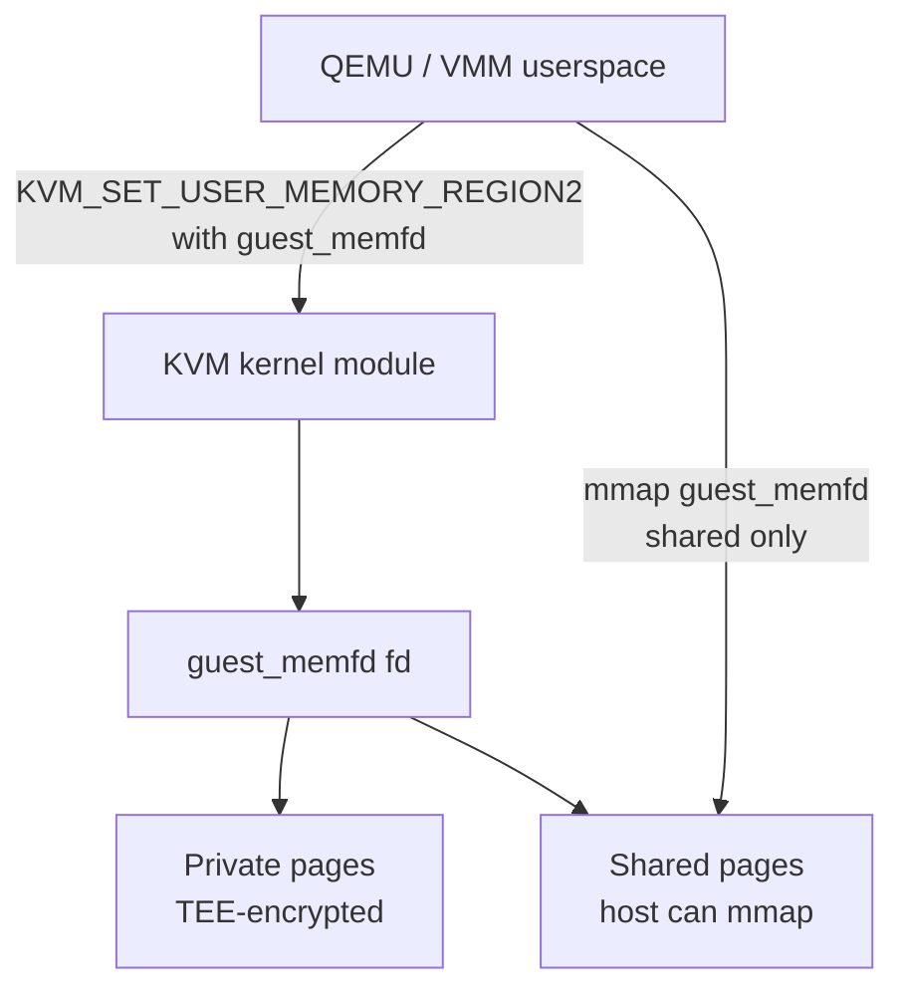

**guest_memfd** is a Linux kernel mechanism for managing **guest-private memory** — physical memory that is mapped into a CoCo VM but not directly accessible to the host kernel or hypervisor. It is backed by a file descriptor (the "memfd") owned by the KVM guest, which tracks page ownership and protects pages from host mapping.

## Why It Exists

In a normal KVM VM, the host can `mmap()` the guest's physical memory through the `kvm_userspace_mem` interface. In a CoCo VM (TDX, SNP, CCA Realm), the TEE hardware prevents the host from reading those pages — but the kernel still needs a way to track which pages are private (TEE-protected) vs. shared (host-accessible DMA buffers).

guest_memfd is the kernel's answer: a memfd-like object that only grants the host access to **shared** pages, and refuses host-accessible mappings of private pages.

## Architecture

## Foundational Work (May 2024 – May 2025)

### guest_memfd Library Refactoring

A recurring theme in the first year: guest_memfd's internals needed to be restructured as a reusable library so that ARM CCA, SEV-SNP, and TDX could share common memory management code rather than duplicating it.

- `mm: Introduce guest_memfd library` (Aug 2024, initial RFC) — first proposal to extract the core guest_memfd logic into a separate library module[^gmemfd-lib-aug].
- Second revision (Aug 2024) refined the API[^gmemfd-lib-aug2].
- `mm: Refactor KVM guest_memfd to introduce guestmem library` (Nov 2024, Elliot Berman, Qualcomm) — a substantially reworked approach: rather than extracting into a library module, this version reorganizes the code into a proper `mm/guestmem.c` unit with a clean API boundary. Three posting rounds in November 2024[^gmemfd-refactor-nov].

The Qualcomm involvement reflects ARM CCA's need for guest_memfd: Realms use guest_memfd for private memory management, so Qualcomm (building CCA-capable hardware) has strong interest in making the library arch-agnostic.

### 2MB THP (Huge Page) Support

`KVM: gmem: 2MB THP support and preparedness tracking changes` (Dec 2024) — a prerequisite series for huge-page support in guest_memfd: adds 2MB transparent huge page (THP) backing for guest_memfd folios. Without this, every private page in a CoCo VM is 4KB, causing significant TLB pressure for large VMs[^gmemfd-thp].

This is the precursor to the in-place conversion work (which is needed to fully enable huge pages: you can't have a 2MB page spanning private and shared halves).

### Bi-Weekly Upstream Calls (Origin)

The guest_memfd community proposed regular upstream calls in October 2024[^gmemfd-biweekly-prop], and the first invitation went out for October 17, 2024[^gmemfd-biweekly-inv]. These bi-weekly calls became the coordination mechanism for the in-place conversion, NUMA mempolicy, and THP series.

### NUMA Mempolicy (Early RFC)

`[RFC PATCH v4] Add fbind and NUMA mempolicy support for KVM guest_memfd` (Nov 2024) — an early version of the NUMA mempolicy series (later reaching v8 in year 2)[^gmemfd-numa-2024].

[^gmemfd-lib-aug]: [20240805-mm-introduce-guest-memfd-library.md](../threads/20240805-mm-introduce-guest-memfd-library.md)
[^gmemfd-lib-aug2]: [20240829-mm-introduce-guest-memfd-library.md](../threads/20240829-mm-introduce-guest-memfd-library.md)
[^gmemfd-refactor-nov]: [20241113-mm-refactor-kvm-guest-memfd-to-introduce-guestmem-library.md](../threads/20241113-mm-refactor-kvm-guest-memfd-to-introduce-guestmem-library.md)
[^gmemfd-thp]: [20241212-kvm-gmem-2mb-thp-support-and-preparedness-tracking-changes.md](../threads/20241212-kvm-gmem-2mb-thp-support-and-preparedness-tracking-changes.md)
[^gmemfd-biweekly-prop]: [20241010-proposal-bi-weekly-guest-memfd-upstream-call.md](../threads/20241010-proposal-bi-weekly-guest-memfd-upstream-call.md)
[^gmemfd-biweekly-inv]: [20241015-invitation-bi-weekly-guest-memfd-upstream-call-on-2024-10-17.md](../threads/20241015-invitation-bi-weekly-guest-memfd-upstream-call-on-2024-10-17.md)
[^gmemfd-numa-2024]: [20241107-rfc-patch-04-add-fbind-and-numa-mempolicy-support-for-kvm-gu.md](../threads/20241107-rfc-patch-04-add-fbind-and-numa-mempolicy-support-for-kvm-gu.md)

## Active Patch Series (May 2025 – May 2026)

### In-Place Conversion (the flagship effort)

The most active guest_memfd patch series: **41 threads / 390 messages** over 12 months, reaching **v6** in May 2026[^inplace-v5][^inplace-v6].

**Problem**: The original guest_memfd design requires two physical memory pools — one for private pages, one for shared pages. Sharing a page means copying it. This blocks huge-page support (huge pages can't span the two pools) and wastes memory.

**Solution**: In-place conversion. A single physical page can transition between private and shared states without copying. The guest_memfd tracks the state per-page.

Key design decisions:
- New ioctl on the guest_memfd fd (not on `/dev/kvm`) for per-page shared/private attribute control.
- Guest-private pages remain unmappable to host userspace even after conversion to "shared" state until explicitly accepted.
- `PRESERVE` semantics (keep page content across state transition) restricted to pre-finalization for TDX/SNP; CCA can use it more freely.
- Foundation for huge-page support in guest_memfd (pending, not yet in this series).
- Extensive selftests: six test suites covering TDX, SNP, and generic paths.

Lead: Ackerley Tng. Reviewers: Sean Christopherson, Michael Roth, Liam Howlett.

→ Details: [guest_memfd In-Place Conversion](../entities/patches/guest-memfd-inplace.md)

### NUMA Mempolicy Support

`Add NUMA mempolicy support for KVM guest-memfd` (RFC v8, 7 patches, 39 messages)[^numa].

guest_memfd pages are allocated without NUMA awareness by default — all pages land on whatever NUMA node has free memory. For NUMA-sensitive workloads (e.g., a VM pinned to a specific NUMA node's CPUs), this can cause significant remote memory latency.

This series adds `mbind()`-style NUMA policy for guest_memfd regions, so that pages are allocated from the preferred NUMA node. The implementation reuses the kernel's existing mempolicy infrastructure.

### Preparation / Population Rework

`KVM: guest_memfd: Rework preparation/population flows in prep for in-place conversion`[^prepflow] — a prerequisite refactor series that cleanly separates the "prepare" (allocate physical pages into guest_memfd) and "populate" (map pages into the guest's second-level page table) phases.

This separation is necessary for in-place conversion: when a page converts from private to shared, only the "populate" step needs to re-run — the physical page stays in the memfd.

### Inline Helper Cleanups

`KVM: guest_memfd: Inline kvm_gmem_get_index()` series[^inline] — small maintenance patches improving the internal structure of the guest_memfd code, reducing indirection and making the folio-based path more consistent.

### Allow Host to Map guest_memfd Pages

`KVM: guest_memfd: Allow host to map guest_memfd pages`[^hostmap] — a separate proposal to allow the host to read guest_memfd shared pages directly via mmap, for debugging purposes. Received mixed feedback about security implications; still under discussion.

### IOMMUFD Integration

`[RFC PATCH] arm64/kernel: iommufd: Allow mapping from KVM's guest_memfd`[^iommufd] — explores using IOMMUFD (the kernel's IOMMU management interface) to map guest_memfd pages through the IOMMU for device DMA, enabling secure DMA for confidential VMs without copying.

## June 2026 Updates

### In-Place Conversion — v8

Ackerley Tng posted v8 (Jun 18, 87 messages — largest single guest_memfd thread yet)[^inplace-v8] of guest_memfd in-place conversion. Key change from v7: **VM memory attributes are not deprecated**. Earlier revisions signaled intent to remove `KVM_CAP_MEMORY_ATTRIBUTES` (the old VM fd interface); v8 walks this back, keeping both the legacy VM-fd path and the new guest_memfd-native per-page ioctl. Both paths remain available for the conversion cycle.

The v8 thread has broad participation — Ackerley Tng, Fuad Tabba, Suzuki K Poulose, Sean Christopherson, Xiaoyao Li — indicating this is close to review consensus.

### Folio Migration for Non-Confidential VMs

Shivank Garg (AMD) posted a 3-patch series (Jun 11, 13 messages)[^folio-migrate] enabling **folio migration for non-CoCo guest_memfd**. Currently guest_memfd folios are marked `AS_UNMOVABLE` — the kernel cannot NUMA-balance or compact them. For CoCo VMs this is unavoidable (encrypted memory requires firmware assistance to copy). For non-CoCo VMs using guest_memfd (e.g. Firecracker for secret hiding), ordinary migration is safe.

The series:
- Splits `AS_UNMOVABLE` back out of `AS_INACCESSIBLE` in the page mapping flags.
- Adds migration support in `kvm/guest_memfd.c` for the non-confidential case.
- Provides a KVM selftest exercising the full migrate-and-verify cycle.

Tested with Firecracker on a 2-NUMA-node host via `migratepages(8)` and `move_pages(2)`.

[^inplace-v8]: [20260618-guest-memfd-in-place-conversion-support.md](../threads/20260618-guest-memfd-in-place-conversion-support.md)
[^folio-migrate]: [20260611-kvm-guest-memfd-folio-migration-for-non-confidential-vms.md](../threads/20260611-kvm-guest-memfd-folio-migration-for-non-confidential-vms.md)

## May 2026 Updates

### In-Place Conversion — v7

Ackerley Tng posted v7 (May 22, 43 messages) of the guest_memfd in-place conversion series[^inplace-v7]. Core design: a new **guest_memfd ioctl** lets userspace set per-page shared/private attributes directly on the memfd file descriptor (rather than through the KVM VM fd), since shared/private-ness is a property of memory, not of the VM. All pages remain mmap()-able by the host; accesses to guest-private pages return `SIGBUS`.

This v7 is a foundation for **guest_memfd huge-page support**: in-place conversion avoids the fragmentation that would arise from punching holes in huge pages when using two separate backing memory pools.

Key difference from v6: the ioctl goes to guest_memfd directly (`KVM_CAP_MEMORY_ATTRIBUTES` path with `CONFIG_KVM_VM_MEMORY_ATTRIBUTES` toggled for testing), not through KVM_VM fd.

### Bind/Populate Fixes

A companion series (May 22, 4 patches) fixed three bugs in the bind and populate flows identified by Sashiko during review of the in-place conversion series[^gmem-fixes]:
- Write permissions missing when GUP-ing source pages (possible write to read-only page)
- Signed integer overflow in `kvm_gmem_bind()` (two instances)
- Unchecked `xa_store_range()` return value

[^inplace-v7]: [20260522-guest-memfd-in-place-conversion-support.md](../threads/20260522-guest-memfd-in-place-conversion-support.md)
[^gmem-fixes]: [20260522-guest-memfd-fixes-for-bind-and-populate.md](../threads/20260522-guest-memfd-fixes-for-bind-and-populate.md)

### Bi-Weekly Calls

The guest_memfd community holds bi-weekly upstream calls (tracked via meeting invite threads on linux-coco)[^biweekly], coordinating patch ordering, review priorities, and integration with other CoCo subsystems.

[^inplace-v5]: [20260428-guest-memfd-in-place-conversion-support.md](../threads/20260428-guest-memfd-in-place-conversion-support.md)
[^inplace-v6]: [20260507-guest-memfd-in-place-conversion-support.md](../threads/20260507-guest-memfd-in-place-conversion-support.md)
[^numa]: [20250827-add-numa-mempolicy-support-for-kvm-guest-memfd.md](../threads/20250827-add-numa-mempolicy-support-for-kvm-guest-memfd.md)
[^prepflow]: [20251113-kvm-guest-memfd-rework-preparationpopulation-flows-in-prep-f.md](../threads/20251113-kvm-guest-memfd-rework-preparationpopulation-flows-in-prep-f.md)
[^inline]: [20250901-kvm-guest-memfd-inline-kvm-gmem-get-index-and-misc-cleanups.md](../threads/20250901-kvm-guest-memfd-inline-kvm-gmem-get-index-and-misc-cleanups.md)
[^hostmap]: [20250602-kvm-guest-memfd-allow-host-to-map-guest-memfd-pages.md](../threads/20250602-kvm-guest-memfd-allow-host-to-map-guest-memfd-pages.md)
[^iommufd]: [20260225-rfc-patch-kernel-iommufd-allow-mapping-from-kvms-guest-memfd.md](../threads/20260225-rfc-patch-kernel-iommufd-allow-mapping-from-kvms-guest-memfd.md)
[^biweekly]: [20250514-invitation-bi-weekly-guest-memfd-upstream-call-on-2025-05-15.md](../threads/20250514-invitation-bi-weekly-guest-memfd-upstream-call-on-2025-05-15.md)

## See Also

- [guest_memfd In-Place Conversion (patch series)](../entities/patches/guest-memfd-inplace.md)
- [PCI/TDISP](pci-tdisp.md)
- [Intel TDX](tdx.md)
