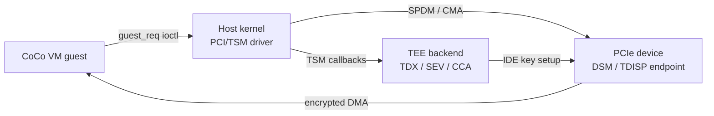

**TDISP (TEE Device Interface Security Protocol)** is the PCIe specification (part of the PCIe 6.0 / CMA/SPDM family) that enables a confidential VM to verify the identity and configuration of a PCIe device before granting it access to private (TEE-encrypted) memory. The Linux kernel implements TDISP support through the **PCI/TSM** framework.

## Why Device Attestation Matters

When a CoCo VM uses DMA (Direct Memory Access), the PCIe device reads and writes the VM's memory. In a standard system, the host VMM configures the IOMMU to restrict DMA. But in a CoCo VM, the host is untrusted — an attacker controlling the host could replace a legitimate device with a rogue one that reads the guest's private memory.

TDISP addresses this by:
1. **Attesting the device** — the guest (or host on behalf of the guest) cryptographically verifies the device's identity using SPDM (Security Protocol and Data Model).
2. **Locking the device configuration** — once verified, the device enters a TDISP LOCK state where its routing and capabilities are frozen.
3. **Encrypting the link** — IDE (Integrity and Data Encryption for PCIe) encrypts traffic between the device and the host, preventing the host from snooping DMA.

## Protocol Stack

**Protocol layers**:

| Layer | Purpose |
|---|---|
| **SPDM** | Authenticate device certificates; establish shared secrets |
| **CMA** (Component Measurement and Authentication) | PCIe binding of SPDM |
| **TDISP** | Lock/run state machine for device-to-TDI binding |
| **IDE** (Integrity and Data Encryption) | Per-stream AES-GCM encryption of PCIe TLP traffic |
| **DSM** (Device Security Manager) | Device-side firmware implementing the above |
| **TSM** | Host-side kernel framework dispatching to TEE backends |

## 2024 Predecessors — Genesis of PCI/TDISP

The PCI/TDISP series that landed in 2025–2026 grew out of a set of earlier RFCs posted in 2024. Each addressed a piece of the device-assignment problem independently; the Dan Williams series unified them.

### PCI/TSM: Authenticate Devices via Platform TSM (May 2024)

`[RFC PATCH v2 5/6] PCI/TSM: Authenticate devices via platform TSM` (May 2024) — the earliest TSM-aware device authentication proposal in the archive. Posted alongside the TSM MR ABI RFC, it introduced the concept of using the TSM framework (rather than a hardware-specific ioctl) as the kernel's device attestation interface[^pci-tsm-may24].

### VFIO/PCI: Host-Inaccessible DMA-buf (Jun 2024)

`[RFC PATCH 08/12] VFIO/PCI: Create host-unaccessible DMA-buf for private memory` (Jun 2024, Xu Yilun) — proposes extending VFIO to create DMA-buf objects that are mapped into guest_memfd private memory but not accessible to the host. This is the VFIO-layer plumbing needed for TDISP device DMA into encrypted VM memory[^vfio-dmabuf].

### PCI Device Authentication RFC (Jun 2024)

`PCI device authentication` (Jun 2024) — a standalone RFC covering the sysfs and ioctl ABI for initiating SPDM-based device authentication from userspace. Served as input to the Dan Williams series on how to expose device certificates to the VMM[^pci-devauth].

### Secure VFIO + TDISP + SEV TIO RFC (Aug 2024)

`[RFC PATCH 00/21] Secure VFIO + TDISP + SEV TIO` (Aug 2024, Alexey Kardashevskiy, AMD) — the largest single PCI/TDISP-related RFC in year 1 (128 messages). Proposed a complete end-to-end design for assigning a TDISP-capable device to an AMD SEV-TIO guest: VFIO extensions for TEE-aware passthrough, TDISP state machine in the kernel, and SEV TIO (TEE I/O) host-side plumbing[^secure-vfio].

This RFC was the most complete end-to-end proposal at the time and heavily influenced the architecture of the Dan Williams series.

### PCI/TSM Core RFC (Dec 2024)

`PCI/TSM: Core Infrastructure for PCI Device Security (TDISP)` (Dec 2024) — Dan Williams's first formal RFC for the unified PCI/TSM series, incorporating lessons from the Aug 2024 Secure VFIO RFC and the VFIO dma-buf work[^pci-tsm-dec24].

### TSM: Secure VFIO + TDISP + SEV TIO RFC v2 (Feb 2025)

`[RFC PATCH v2 00/22] TSM: Secure VFIO + TDISP + SEV TIO` (Feb 2025) — Alexey Kardashevskiy's second revision of the Secure VFIO RFC, now rebased on top of the Dan Williams core series and aligned with the emerging TSM framework API[^secure-vfio-v2].

### PCI/TSM: Core Infrastructure (Mar 2025)

`PCI/TSM: Core Infrastructure for PCI Device Security (TDISP)` (Mar 2025) — the second revision of Dan Williams's core series, making it the "v2" that preceded the RFC v1 May 2025 posting in the year-2 coverage[^pci-tsm-mar25].

[^pci-tsm-may24]: [20240508-rfc-patch-v2-56-pcitsm-authenticate-devices-via-platform-tsm.md](../threads/20240508-rfc-patch-v2-56-pcitsm-authenticate-devices-via-platform-tsm.md)
[^vfio-dmabuf]: [20240618-rfc-patch-0812-vfiopci-create-host-unaccessible-dma-buf-for.md](../threads/20240618-rfc-patch-0812-vfiopci-create-host-unaccessible-dma-buf-for.md)
[^pci-devauth]: [20240630-pci-device-authentication.md](../threads/20240630-pci-device-authentication.md)
[^secure-vfio]: [20240823-rfc-patch-0021-secure-vfio-tdisp-sev-tio.md](../threads/20240823-rfc-patch-0021-secure-vfio-tdisp-sev-tio.md)
[^pci-tsm-dec24]: [20241205-pcitsm-core-infrastructure-for-pci-device-security-tdisp.md](../threads/20241205-pcitsm-core-infrastructure-for-pci-device-security-tdisp.md)
[^secure-vfio-v2]: [20250218-rfc-patch-v2-0022-tsm-secure-vfio-tdisp-sev-tio.md](../threads/20250218-rfc-patch-v2-0022-tsm-secure-vfio-tdisp-sev-tio.md)
[^pci-tsm-mar25]: [20250303-pcitsm-core-infrastructure-for-pci-device-security-tdisp.md](../threads/20250303-pcitsm-core-infrastructure-for-pci-device-security-tdisp.md)

## Active Patch Series (May 2025 – May 2026)

### PCI/TSM Core Infrastructure (TDISP)

The largest and most sustained effort in this category. Dan Williams's series establishing the **vendor-agnostic TDISP framework** in the kernel[^pci-tsm-core]. Timeline:

| Version | Date | Messages | Status |
|---|---|---|---|
| RFC v1 | May 2025 | 173 | Initial RFC |
| v2 | July 2025 | 74 | Second revision |
| v3 | Aug/Oct 2025 | 57+43 | Merged into tsm.git#next |

v3 key additions:
- `bind/unbind/guest_req/accept` operations on the TSM device interface.
- `sample/devsec/` as a reference implementation and test harness.
- Proper IDE stream lifecycle management.
- Coordination point: `tsm.git#staging` (Dan Williams's tree).

→ Details: [PCI/TSM TDISP (patch series)](../entities/patches/pci-tsm-tdisp.md)

### Host-Side KVM/VFIO/IOMMUFD (TDISP)

`[RFC PATCH 00/30] Host side (KVM/VFIO/IOMMUFD) support for TDISP`[^tdisp-host] — the complement to the PCI/TSM series: wires up VFIO device passthrough and IOMMUFD so that a guest_memfd-backed device assignment can cross the IOMMU boundary correctly. 30 patches, 68 messages.

### PCI/TSM: TDX Connect (SPDM + IDE)

`PCI/TSM: TDX Connect: SPDM Session and IDE Establishment`[^tdisp-tdx] — the Intel TDX-specific backend for TDISP: once the generic infrastructure is in place, this series wires TDX's IDE key programming interface (`TDH.MEM.PAGE.AUG` / TDX Connect protocol) into the TSM callbacks. Went through multiple revisions (RFC → v2, 59+74 messages).

### PCI/TSM: PCIe Link Encryption via TDX Platform Services

`PCI/TSM: PCIe Link Encryption Establishment via TDX platform services`[^tdisp-pcie] — extends the TDX Connect series for the full link encryption case: after SPDM establishes shared secrets, this series programs the IDE key material through the TDX Module (via SEAMCALL) to protect DMA traffic end-to-end. 140 messages, the second-largest TDISP thread.

### PCI/TSM: SEV-TIO (AMD TEE I/O)

`PCI/TSM: coco/sev-guest: Implement SEV-TIO PCIe TDISP (phase 2)`[^tdisp-sev] — the AMD SEV-SNP-specific backend. AMD's mechanism is called TEE I/O (TIO). Phase 2 covers the full LOCK/RUN state transition for SEV guests. 56 messages.

### PCI/TSM: TEE I/O Infrastructure (Guest-Side)

`PCI/TSM: TEE I/O infrastructure`[^tee-io] — guest-side infrastructure: userspace interception of driver attachment, netlink ABI for retrieving device attestation evidence, and MMIO resource classification (IORES_DESC_ENCRYPTED) for automatically handling encrypted regions. 99 messages, v2.

### TSM Link Infrastructure

`PCI/TSM: Finalize "Link" TSM infrastructure` (Nov 2025)[^tdisp-link] — finalizes the "Link TSM" abstraction that represents the per-device TDISP session, separating it from the TSM host object.

### ARM CCA Device Assignment

→ See [ARM CCA](arm-cca.md) for the RFC v1/v4 ARM-side TDISP implementation.

## June 2026 Updates

### PCI/TSM: D0 Resume for CMA-SPDM

Lukas Wunner posted a 2-patch series (Jun 15, 5 messages)[^d0-resume] requiring devices to be in D0 state before CMA-SPDM operations. Per PCIe r7.0 §6.31.3, CMA-SPDM in non-D0 states is optional with no discovery mechanism, so the fix unconditionally resumes to D0 for the duration of a CMA-SPDM exchange — matching the Windows behavior confirmed by Vivaik. Targeting v7.3 via `tsm.git/next`.

**Notable: LLM-generated bug report rejected.** A one-patch `use-after-free` fix for `find_dsm_dev()` (Jun 16)[^llm-reject] was dismissed by Lukas Wunner as an LLM-hallucinated bug: the code comment explicitly states the returned device's lifetime is managed by its registration, not by the `__free(pci_dev_put)` annotation on the local variable. Wunner asked the submitter to add an `Assisted-by:` tag per `Documentation/process/coding-assistants.rst` for future AI-assisted patches.

[^d0-resume]: [20260615-pcitsm-resume-device-to-d0-for-cma-spdm-operation.md](../threads/20260615-pcitsm-resume-device-to-d0-for-cma-spdm-operation.md)
[^llm-reject]: [20260616-pcitsm-fix-use-after-free-in-find-dsm-dev.md](../threads/20260616-pcitsm-fix-use-after-free-in-find-dsm-dev.md)

## May 2026 Updates

### IOMMUFD Ioctls for TSM Operations — v5

Aneesh Kumar K.V (ARM) posted v5 (May 25, 14 messages) adding **iommufd ioctls for TSM device management**[^iommufd-tsm]. The series provides `IOMMU_VDEVICE_TSM_REQ` — an ioctl that allows VMMs to perform TSM bind/unbind operations and handle guest device requests via iommufd rather than through KVM or VFIO directly.

Key changes from v4: switch to `struct file *kvm_file` instead of `kvm->users_count` reference counting; define TSM request scope values globally in iommufd; renamed ioctl to `IOMMU_VDEVICE_TSM_REQ`. Two new patches associate `struct kvm *` pointers with `iommufd_device` and `iommufd_viommu` objects.

The series explicitly drops the TSM map ioctl (superseded by the KVM prefault patch for private memory pre-allocation).

### crypto/ccp/tsm: PCIe IDE Root Port Ordering Fix

A one-patch fix by Alexey Kardashevskiy (May 21)[^ccp-rp] enforces the PCIe r7.0 §6.33.8 rule: for Selective IDE with config-request IDE enabled, the endpoint stream must be enabled **before** the root port. The existing `sev-dev-tsm.c` code reversed this order.

`Fixes: 4be423572da1 ("crypto/ccp: Implement SEV-TIO PCIe IDE (phase1)")`

[^iommufd-tsm]: [20260525-add-iommufd-ioctls-to-support-tsm-operations.md](../threads/20260525-add-iommufd-ioctls-to-support-tsm-operations.md)
[^ccp-rp]: [20260521-cryptoccptsm-enable-the-root-port-after-the-endpoint.md](../threads/20260521-cryptoccptsm-enable-the-root-port-after-the-endpoint.md)

[^pci-tsm-core]: [20250515-pcitsm-core-infrastructure-for-pci-device-security-tdisp.md](../threads/20250515-pcitsm-core-infrastructure-for-pci-device-security-tdisp.md)
[^tdisp-host]: [20250529-rfc-patch-0030-host-side-kvmvfioiommufd-support-for-tdisp-us.md](../threads/20250529-rfc-patch-0030-host-side-kvmvfioiommufd-support-for-tdisp-us.md)
[^tdisp-tdx]: [20251117-pcitsm-tdx-connect-spdm-session-and-ide-establishment.md](../threads/20251117-pcitsm-tdx-connect-spdm-session-and-ide-establishment.md)
[^tdisp-pcie]: [20260328-pcitsm-pcie-link-encryption-establishment-via-tdx-platform-s.md](../threads/20260328-pcitsm-pcie-link-encryption-establishment-via-tdx-platform-s.md)
[^tdisp-sev]: [20260225-pcitsm-cocosev-guest-implement-sev-tio-pcie-tdisp-phase2.md](../threads/20260225-pcitsm-cocosev-guest-implement-sev-tio-pcie-tdisp-phase2.md)
[^tee-io]: [20260302-pcitsm-tee-io-infrastructure.md](../threads/20260302-pcitsm-tee-io-infrastructure.md)
[^tdisp-link]: [20251112-pcitsm-finalize-link-tsm-infrastructure.md](../threads/20251112-pcitsm-finalize-link-tsm-infrastructure.md)

## See Also

- [PCI/TSM TDISP (patch series)](../entities/patches/pci-tsm-tdisp.md)
- [TSM Framework](tsm-framework.md)
- [guest_memfd](guest-memfd.md)
- [Intel TDX](tdx.md)
- [AMD SEV-SNP](sev-snp.md)
- [ARM CCA](arm-cca.md)
