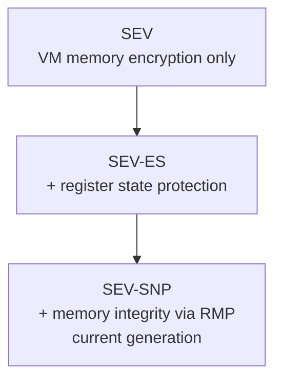

**Secure Encrypted Virtualization (SEV)** is AMD's family of hardware TEEs for virtual machines. The current generation, **SEV-SNP** (Secure Nested Paging), adds memory integrity protection via a hardware data structure called the **Reverse Map Table (RMP)** that enforces which VM can access which physical page.

## SEV Family Overview

| Feature | SEV | SEV-ES | SEV-SNP |
|---|---|---|---|
| Memory encryption | ✓ | ✓ | ✓ |
| Register state protection | — | ✓ | ✓ |
| Memory integrity (RMP) | — | — | ✓ |
| Attestation report | Basic | Basic | Full |

## Architecture

**RMP (Reverse Map Table)** — a hardware table mapping every 4KB physical page to its owner (hypervisor or a specific VM). When a VM writes to a page, the CPU hardware checks the RMP to ensure the VM owns that page. An RMP violation terminates the access.

**PVALIDATE** — an instruction executed by the VM to accept pages into its private address space. Before pvalidate, pages are in the "hypervisor" state.

**Attestation** — a VM can request a hardware-signed attestation report from the AMD Secure Processor (ASP/PSP) proving its measurement and platform configuration.

## Foundational Work (May 2024 – May 2025)

### KVM SNP Attestation and KVM_EXIT_COCO

`SEV-SNP: Add KVM support for attestation and KVM_EXIT_COCO` (Jun–Jul 2024) — adds a new `KVM_EXIT_COCO` exit reason that allows the VMM (QEMU) to handle SNP attestation requests from the guest without requiring a special kernel interface. The guest sends an attestation request via GHCB (Guest Hypervisor Communication Block); KVM delivers a `KVM_EXIT_COCO` to userspace which fetches the attestation report from the PSP and injects it back[^snp-attest-coco].

This enables userspace VMMs to fully implement the guest attestation flow. Multiple revisions through Jul 2024 addressed review feedback on GHCB handling and error propagation[^snp-attest-v2].

### SEV-ES kexec / kdump Support

`x86/sev: kexec/kdump support for SEV-ES guests` (Jun 2024) — SEV-ES encrypts guest register state on VM exit. kexec and kdump operations require tearing down and reinitializing the SEV-ES environment (VMSA, GHCB mappings) before jumping to a new kernel. This series implements the required teardown sequence[^seves-kexec].

### SVSM Calling Areas / SEV-SNP under SVSM

`x86/sev: Use kernel-provided SVSM calling areas` (May 2024) — the guest Linux kernel needs a stable memory area for SVSM call buffers. This patch series moves from a BIOS-provided area to a kernel-allocated calling area, giving the kernel full control over the buffer lifetime[^svsm-areas].

`Provide SEV-SNP support for running under an SVSM` (Jun 2024) — when the guest kernel runs at VMPL1 with an SVSM at VMPL0, some operations (page validation, GHCB management) must be delegated to the SVSM rather than done directly. This series wires those delegation paths[^snp-svsm].

### KVM SEV-SNP Support for Running an SVSM

`[RFC PATCH] KVM: SEV-SNP support for running an SVSM` (Aug 2024) — the complementary host-side change: when QEMU launches an SNP VM with an SVSM payload, KVM must set up VMPL0 with the SVSM image and initialize the VMPL call interface[^kvm-svsm].

### Allowed SEV Features

`KVM: SEV: Add support for the "allowed SEV features" feature` (Aug 2024) — AMD CPUs can advertise a "feature policy" restricting which SEV features may be enabled for a given VM. This series adds KVM enforcement of the allowed-features policy, preventing a VMM from enabling features the PSP would reject[^sev-features].

### SEV Firmware Hotloading

`Add SEV firmware hotloading` (Nov 2024) — SEV firmware (PSP firmware) historically required a reboot to update. This series implements runtime hotloading of PSP firmware using the `psp_fw_upgrade` mechanism, allowing security updates to the AMD Secure Processor without rebooting the host[^sevhotload]. Two posting rounds in November 2024 addressed review feedback on the update flow and error handling.

### Move SEV/SNP Initialization to KVM

`Move initializing SEV/SNP functionality to KVM` (Dec 2024 – Mar 2025) — refactors AMD SEV/SNP initialization code out of the CCP (Crypto Co-Processor) driver and into KVM. The motivation: SEV/SNP init has KVM-specific concerns (ASIDs, RMP setup) that don't belong in a generic crypto driver[^snp-kvm-init]. Series went through multiple revisions into early 2025.

### SNP Certificate Fetching via KVM

`SEV-SNP: Add KVM support for SNP certificate fetching via KVM` (Nov–Dec 2024) — adds a KVM interface for fetching the PSP certificate chain used to verify SNP attestation reports. Previously this required a separate userspace tool; the KVM interface lets the VMM retrieve certificates programmatically[^snp-cert].

[^snp-attest-coco]: [20240621-sev-snp-add-kvm-support-for-attestation-and-kvm-exit-coco.md](../threads/20240621-sev-snp-add-kvm-support-for-attestation-and-kvm-exit-coco.md)
[^snp-attest-v2]: [20240701-sev-snp-add-kvm-support-for-attestation.md](../threads/20240701-sev-snp-add-kvm-support-for-attestation.md)
[^seves-kexec]: [20240610-x86sev-kexeckdump-support-for-sev-es-guests.md](../threads/20240610-x86sev-kexeckdump-support-for-sev-es-guests.md)
[^svsm-areas]: [20240508-x86sev-use-kernel-provided-svsm-calling-areas.md](../threads/20240508-x86sev-use-kernel-provided-svsm-calling-areas.md)
[^snp-svsm]: [20240605-provide-sev-snp-support-for-running-under-an-svsm.md](../threads/20240605-provide-sev-snp-support-for-running-under-an-svsm.md)
[^kvm-svsm]: [20240827-rfc-patch-07-kvm-sev-snp-support-for-running-an-svsm.md](../threads/20240827-rfc-patch-07-kvm-sev-snp-support-for-running-an-svsm.md)
[^sev-features]: [20240822-kvm-sev-add-support-for-the-allowed-sev-features-feature.md](../threads/20240822-kvm-sev-add-support-for-the-allowed-sev-features-feature.md)
[^sevhotload]: [20241107-add-sev-firmware-hotloading.md](../threads/20241107-add-sev-firmware-hotloading.md)
[^snp-kvm-init]: [20241209-move-initializing-sevsnp-functionality-to-kvm.md](../threads/20241209-move-initializing-sevsnp-functionality-to-kvm.md)
[^snp-cert]: [20241119-sev-snp-add-kvm-support-for-snp-certificate-fetching-via-kvm.md](../threads/20241119-sev-snp-add-kvm-support-for-snp-certificate-fetching-via-kvm.md)

## Active Patch Series (May 2025 – May 2026)

### AMD RMPOPT — RMP Optimization

AMD added an optional hardware feature, **RMPOPT**, that allows the hypervisor to mark 1GB-aligned regions as "hypervisor-only" — the CPU then skips RMP checks for writes to those regions entirely, avoiding the per-page RMP lookup overhead.

The RMPOPT patch series went through three revisions (v2 with 42 messages)[^rmpopt]. Key design decisions:
- A new x86 CPU feature flag `X86_FEATURE_AMD_RMPOPT` detects RMPOPT availability[^rmpoptcpu].
- Regions are configured via a new MSR interface.
- Integration with guest_memfd: when a page is converted to shared (guest_memfd "free"), the RMPOPT region for that page must be invalidated before the page is reused.
- `configfs` interface was dropped in v2; cleanup is now automatic.

### SEV-SNP Unaccepted Memory Hotplug

SEV-SNP guests must accept (pvalidate) every page before first use. When the host hot-adds memory to a running SEV-SNP guest, the guest must accept the new pages without disrupting the running system.

The RFC patch series (4 patches, 40 messages) decouples the unaccepted memory bitmap from the fixed unaccepted table to allow kernel-managed updates during hotplug. Hot-remove requires reversing pvalidation, which has edge cases when pages are already shared[^snphotplug].

### KVM: SEV: IBPB-on-Entry

SEV-ES and SEV-SNP guests run with encrypted register state. On VM-entry, the host kernel optionally flushes indirect branch predictors (IBPB) to prevent speculative execution side-channels where the host's branch predictor state could be used to infer information about the guest.

This patch series adds proper IBPB-on-entry support for SEV guests, aligning with the general IBPB infrastructure already in KVM[^ibpb].

### KVM: SEV: Disable on Init Failure

Patch series: `KVM: SEV: Disable SEV-SNP support on initialization failure`. If SNP initialization fails (e.g., firmware version mismatch, ASID exhaustion), KVM now disables SNP for all subsequent VMs rather than silently creating VMs in an undefined state[^snpinit].

## June 2026 Updates

### RMPOPT — v2

Ashish Kalra posted RMPOPT v2 (Jun 2, 7 messages)[^rmpopt-v2], incorporating review feedback on v1. The core design is unchanged — RMPOPT instruction marks 1GB regions as hypervisor-owned in the RMPOPT table, enabling hardware to skip RMP checks for writes into those regions. v2 addresses reviewer comments on the implementation details.

[^rmpopt-v2]: [20260602-add-rmpopt-support.md](../threads/20260602-add-rmpopt-support.md)

### PV Clocks vs. TSC — Security Fix for CoCo Guests

Sean Christopherson posted a large series (May 29, 66 messages, v4 with 47 patches)[^pvclocks] fixing a **security flaw affecting SNP and TDX guests**: these guests were using a PV clock (kvmclock, Xen PV) provided by the untrusted hypervisor for timekeeping instead of the hardware TSC protected by trusted firmware. A malicious or compromised hypervisor could manipulate guest time via PV clocks.

The series enforces that SNP and TDX guests always derive time from the secure hardware TSC, and as a secondary goal modernizes KVM guest PV clock enumeration (TSC/APIC frequencies via CPUID 0x40000010). The series also deduplicates PV clock logic across hypervisors (KVM, Xen, VMware). Needed acks from VMware and Xen maintainers due to prior fatal NULL pointer deref bugs in earlier revisions.

[^pvclocks]: [20260529-x86-try-to-wrangle-pv-clocks-vs-tsc.md](../threads/20260529-x86-try-to-wrangle-pv-clocks-vs-tsc.md)

## May 2026 Updates

### RMPOPT — v1

Ashish Kalra (AMD) posted the first upstream posting of **RMPOPT** (May 18, 15 messages)[^rmpopt-v1]. RMPOPT is a new AMD CPU instruction that optimizes RMP (Reverse Map Table) write checks for the hypervisor and non-SNP guests. In SNP-enabled systems, every write must be RMP-checked to protect SNP guest memory integrity — a performance cost even for non-SNP workloads.

RMPOPT allows software to mark 1 GB regions as "entirely hypervisor-owned" in a separate RMPOPT table. Once marked, hardware skips RMP checks for writes into those regions. Hardware automatically clears the RMPOPT bit via RMPUPDATE when any page in the region is assigned to a guest.

The v1 series enables RMP optimizations for up to **2 TB of system RAM**; support beyond 2 TB is deferred to a follow-on series. There is an earlier x86 CPU feature flag posting from February 2026[^rmpopt-flag] that precedes this series.

[^rmpopt-v1]: [20260518-add-rmpopt-support.md](../threads/20260518-add-rmpopt-support.md)
[^rmpopt-flag]: [20260217-x86cpufeatures-add-x86-feature-amd-rmpopt-feature-flag.md](../threads/20260217-x86cpufeatures-add-x86-feature-amd-rmpopt-feature-flag.md)

## SVSM Integration

AMD's **Secure VM Service Module (SVSM)** runs in VMPL0 (the most privileged SEV-SNP privilege level) inside a VM. It provides services to the guest OS running at VMPL1+: vTPM, filesystem encryption, key management. See [SVSM](svsm.md) for the full overview.

Linux kernel integration patches for SVSM include `x86/sev: Carve out the SVSM support code` (restructuring how the kernel discovers and communicates with a SVSM)[^svsm-carve] and `KVM Planes with SVSM on Linux v6.17`[^svsm-planes].

## Confidential VMBus

The **Confidential VMBus** patch series (v4, 50 messages) enables encrypted data flow from physical devices into Hyper-V guests running under AMD SEV-SNP or Intel TDX. The host VMM (Hyper-V/OpenVMM) acts as a paravisor mediating device access, keeping the physical host out of the guest's TCB while still allowing I/O[^vmbus].

[^rmpopt]: [20260302-add-rmpopt-support.md](../threads/20260302-add-rmpopt-support.md)
[^rmpoptcpu]: [20260217-x86cpufeatures-add-x86-feature-amd-rmpopt-feature-flag.md](../threads/20260217-x86cpufeatures-add-x86-feature-amd-rmpopt-feature-flag.md)
[^snphotplug]: [20251125-rfc-patch-04-sev-snp-unaccepted-memory-hotplug.md](../threads/20251125-rfc-patch-04-sev-snp-unaccepted-memory-hotplug.md)
[^ibpb]: [20260126-kvm-sev-add-support-for-ibpb-on-entry.md](../threads/20260126-kvm-sev-add-support-for-ibpb-on-entry.md)
[^snpinit]: [20250508-kvm-sev-disable-sev-snp-support-on-initialization-failure.md](../threads/20250508-kvm-sev-disable-sev-snp-support-on-initialization-failure.md)
[^svsm-carve]: [20251204-x86sev-carve-out-the-svsm-support-code.md](../threads/20251204-x86sev-carve-out-the-svsm-support-code.md)
[^svsm-planes]: [20251022-kvm-planes-with-svsm-on-linux-v617.md](../threads/20251022-kvm-planes-with-svsm-on-linux-v617.md)
[^vmbus]: [20250714-confidential-vmbus.md](../threads/20250714-confidential-vmbus.md)

## See Also

- [SVSM](svsm.md)
- [TSM Framework](tsm-framework.md)
- [PCI/TDISP](pci-tdisp.md)
