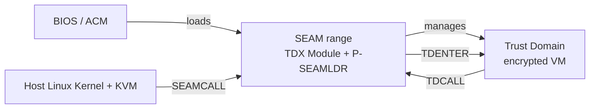

**Trust Domain Extensions (TDX)** is Intel's hardware Trusted Execution Environment for virtual machines. A **Trust Domain (TD)** is a guest VM whose memory is encrypted and isolated by the TDX Module — a digitally-signed software module running in a special CPU mode called SEAM (Secure Arbitration Mode). The host kernel and VMM cannot read or modify TD memory.

## Architecture

Key components:

| Component | Role |
|---|---|
| **TDX Module** | Digitally-signed firmware managing TD lifecycle (create, run, destroy). Runs in SEAM mode. |
| **P-SEAMLDR** | Privileged SEAM Loader — loads and updates the TDX Module at runtime. Persists across TDX Module updates. |
| **KVM TDX** | Host-side kernel driver making SEAMCALL calls to create/run TDs. |
| **SEPT (Secure EPT)** | Second-level page table managed by TDX Module for TD private memory. |
| **PAMT (Physical Address Metadata Table)** | Per-page TDX metadata table used by the module to track memory ownership. |

## Foundational Work (May 2024 – May 2025)

### TDX kexec Support

Enabling kexec (jump to a new kernel without rebooting) in a running TDX guest requires tearing down all private memory and resetting TDX state before the jump. Multiple revisions landed on linux-coco starting in May 2024.

The first wave addressed the basic kexec flow: converting shared memory back to private before kexec[^kexec-shared], then adding the full kexec sequence[^kexec-v1]. Crash-on-kexec regressions were fixed in June 2024[^kexec-crash]. Work continued into 2025 — unaccepted-memory kexec (how to handle lazy-accepted pages across kexec) produced a separate series[^kexec-unaccepted].

### TDX MMIO from Userspace (SIGBUS)

TDX guests emulate MMIO via a `#VE` (virtualization exception) trap. When a TDX guest instruction triggers an MMIO access that the VMM cannot handle, the canonical error path is to deliver `SIGBUS` to the triggering process rather than crashing the whole VM.

The series `x86/tdx: Generate SIGBUS on userspace MMIO` (May/June 2024) adds this behavior[^mmio-sigbus]. A follow-on series, `x86/tdx: Allow MMIO instructions from userspace` (July 2024), extends the MMIO emulation to fully handle userspace-initiated MMIO in TDX guests[^mmio-user].

A data-leak fix for MMIO reads was also posted (August 2024)[^mmio-leak], tightening the handling of partial reads.

### TDX TDCALL Wrapper Rewrite

`x86/tdx: Rewrite TDCALL wrappers` (May 2024) — rewrites the assembly stubs that invoke TDCALL instructions. The previous implementation had fragile register-save patterns; the rewrite uses a more structured approach that makes the wrappers easier to audit and extend[^tdcall]. A follow-on series enhanced code generation for SEAMCALL wrappers as well[^seamcall].

### TDX Memory Hotplug Check

`x86/tdx: Memory hotplug — check whole hot-adding memory range for TDX` (Sep–Oct 2024) — when the host adds memory to a running TDX system, the driver must verify the entire new memory range is within a valid TDMR (TD Memory Region) before allowing the hotplug. Multiple iterations addressed edge cases with non-contiguous ranges[^hotplug24].

### TDX Userspace Hypercalls

`Support userspace hypercalls for TDX` (Jul 2024) — allows TDCALL instructions from userspace (not just kernel mode), enabling TDX-aware userspace applications to directly request services from the TDX Module (e.g., for attestation) without a kernel syscall wrapper[^ucall].

### TDX TD Settings / Boot Adjustments

`x86/tdx: Adjust TD settings on boot` went through multiple revisions (May, June, August 2024) as reviewers requested changes to how TD configuration attributes (TDCS fields) are applied at TD initialization time[^tdboot].

[^kexec-shared]: [20240508-x86tdx-convert-shared-memory-back-to-private-on-kexec.md](../threads/20240508-x86tdx-convert-shared-memory-back-to-private-on-kexec.md)
[^kexec-v1]: [20240528-x86tdx-add-kexec-support.md](../threads/20240528-x86tdx-add-kexec-support.md)
[^kexec-crash]: [20240629-x86tdx-fix-crash-on-kexec.md](../threads/20240629-x86tdx-fix-crash-on-kexec.md)
[^kexec-unaccepted]: [20241021-kexec-core-accept-unaccepted-kexec-destination-addresses.md](../threads/20241021-kexec-core-accept-unaccepted-kexec-destination-addresses.md)
[^mmio-sigbus]: [20240521-x86tdx-generate-sigbus-on-userspace-mmio.md](../threads/20240521-x86tdx-generate-sigbus-on-userspace-mmio.md)
[^mmio-user]: [20240730-x86tdx-allow-mmio-instructions-from-userspace.md](../threads/20240730-x86tdx-allow-mmio-instructions-from-userspace.md)
[^mmio-leak]: [20240826-x86tdx-fix-data-leak-in-mmio-read.md](../threads/20240826-x86tdx-fix-data-leak-in-mmio-read.md)
[^tdcall]: [20240517-x86tdx-rewrite-tdcall-wrappers.md](../threads/20240517-x86tdx-rewrite-tdcall-wrappers.md)
[^seamcall]: [20240602-x86tdx-enhance-code-generation-for-tdcall-and-seamcall-wrapp.md](../threads/20240602-x86tdx-enhance-code-generation-for-tdcall-and-seamcall-wrapp.md)
[^hotplug24]: [20240930-tdx-memory-hotplug-check-whole-hot-adding-memory-range-for-t.md](../threads/20240930-tdx-memory-hotplug-check-whole-hot-adding-memory-range-for-t.md)
[^ucall]: [20240703-support-userspace-hypercalls-for-tdx.md](../threads/20240703-support-userspace-hypercalls-for-tdx.md)
[^tdboot]: [20240512-x86tdx-adjust-td-settings-on-boot.md](../threads/20240512-x86tdx-adjust-td-settings-on-boot.md)

## May 2026 Updates

### Runtime TDX Module Update — v9/v10

The fw_upload-based non-disruptive TDX module update series continued its rapid iteration in May 2026. **v9** (Chao Gao, May 13) adopted a new `tdx_blob` format suggested by Dave Hansen, removed module version printing during updates, and reworked the update state machine loop for readability[^tdxupdate-v9]. **v10** (May 20) polished variable names (`data_len`, `is_lead_cpu`), added early bounds checks against `SEAMLDR_MAX_NR_*` limits, and fixed a `BIT(16)` → `BIT_ULL(16)` overflow. The series targets **kernel 7.2** and is considered mature enough for merge pending final review[^tdxupdate-v10].

### TDX Module Extensions + DICE-Based TDX Quoting

Xu Yilun posted an RFC (v1, May 22) introducing **TDX Module Extensions** — a new capability in the TDX Module that enables complex, preemptible flows inside the SEAM range via "Extension SEAMCALLs." Extensions require ~50 MB of additional host memory added via `TDH.EXT.MEM.ADD` and initialized via `TDH.EXT.INIT`; they are off by default and must be explicitly enabled[^tdxext].

The first feature built on Extensions is **DICE-based TDX Quoting** — an industry-standard certificate-chain attestation framework that produces TDX quotes through a chain of DICE certificates rather than the traditional TDREPORT path. The RFC covers the initialization infrastructure (first 4 patches), with DICE-quoting patches included as a usage example. The x86 KVM changes are preliminary; the RFC explicitly targets acks for the generic Extensions init code.

### TDX Dynamic PAMT — v6

Rick Edgecombe posted Dynamic PAMT v6 (May 25), resolving conflicts between his v4 and Sean Christopherson's "mega v5" that combined MMU refactor, DPAMT, and huge-page work[^dpamt-v6]. The resolution rolls back to the v4 caching approach for S-EPT backing pages after multiple alternative proposals failed on review. v6 is described as mature but blocked on two prerequisite series (TDX MMU refactor split and VMXON bringup) that must land first. Collecting acks while waiting.

### TDX KVM Selftests

Lisa Wang posted the first **TDX KVM selftest** series (May 21, 26 messages), covering the full TDX VM lifecycle: bring-up, boot via x86 reset vector, and teardown[^tdxselftests]. Because TDX protects guest register state from the host, the tests cannot use standard KVM register injection (KVM_SET_SREGS/GPRs); instead, the host writes values into a known memory region and a small boot stub in the guest reads and applies them. The ucall mechanism is also adapted: PIO carries the ucall address in the port number rather than the data payload.

### TDX Offline CPU Bug

A preemption assertion violation was reported in `tdx_offline_cpu()`: it calls `tdx_cpu_flush_cache()` which asserts `lockdep_assert_preemption_disabled()`, but the CPUHP_AP_ONLINE_DYN offline callback runs with preemption enabled. Fix: wrap the call with `preempt_disable()`/`preempt_enable()` at the offline site[^tdxcpubug].

### Rick Edgecombe — TDX Co-Maintainer

Rick Edgecombe (Intel) was promoted from TDX reviewer to **TDX co-maintainer** (alongside Kiryl Shutsemau) in `MAINTAINERS`, effective May 27. Edgecombe has led key TDX host-side work including the initial KVM integration, Dynamic PAMT, and the VMXON bringup series[^tdxmaintainer].

## Active Patch Series (May 2025 – May 2026)

### Runtime TDX Module Update

The dominant effort on linux-coco in this period. TDX modules historically required a system reboot to update — operationally disruptive for production servers running live TDs.

The patch series implements **non-disruptive TDX module firmware update** via the kernel's `fw_upload` mechanism, using P-SEAMLDR to swap the TDX Module in-place while preserving running TDs. The series went through 8 revisions in 12 months and is targeting merge for **kernel 7.2**[^tdxupdate-v8].

→ Details: [TDX Module Update](../entities/patches/tdx-module-update.md)

### TDX Dynamic PAMT + S-EPT Hugepage

Addresses two performance gaps in TDX memory management:

1. **Dynamic PAMT** (Rick Edgecombe): the static PAMT requires pre-allocating ~1/256th of physical memory at boot for metadata. Dynamic PAMT uses sparse allocation, dramatically reducing overhead on large machines[^tdxpamt].
2. **S-EPT Hugepage** (Yan Zhao): TDX's Secure EPT currently forces 4KB granularity; huge-page support would improve TD performance substantially.

Combined into RFC v5 with 45 patches and 151 messages. Still dependent on the VMXON series landing first[^tdxpamt].

→ Details: [TDX Dynamic PAMT](../entities/patches/tdx-dynamic-pamt.md)

### TDX VMXON Bringup

`KVM: x86/tdx: Have TDX handle VMXON during bringup` (Chao Gao, v3) — restructures KVM's VMXON path to properly initialize TDX-specific state during CPU bring-up, fixing a race that could leave TDX in a bad state on secondary CPUs[^vmxon].

### TDX Memory Hotplug

`x86/tdx: Fix memory hotplug in TDX guests` — TDX guest VMs using unaccepted memory (lazy acceptance) could encounter issues when the host added memory after boot. This patch series addresses the synchronization between the guest's memory acceptance state and the kernel's memory hotplug path[^hotplug].

### TDX kexec

`Fuller TDX kexec support` — extends kexec to properly tear down TDX state before jumping to a new kernel, preventing TDX-managed pages from becoming inaccessible after kexec[^kexec].

### struct page → PFN conversion

`struct page to PFN conversion for TDX guest private memory` — TDX private memory cannot have a `struct page` (it is not mapped in the host's direct map), so callers must use PFNs directly. This series audits and converts KVM's TDX memory management to use PFNs throughout[^pfn].

### TDX Module Version

`Expose TDX Module version` / `x86/virt/tdx: Print TDX module version to dmesg` — adds sysfs and dmesg logging of the loaded TDX Module version, enabling operators to confirm which module is active without reading BIOS logs[^version].

## Key Concepts

**SEAMCALL / TDCALL** — the two instruction interfaces. The host calls SEAMCALLs to manage TDs. The TD calls TDCALLs to request services from the TDX Module (e.g., attestation, hypercall).

**TD Measurement Register (TDMR)** — defines which memory regions are assigned to TDX. Set up at boot by the host kernel.

**Unaccepted Memory** — TDX guests (and SEV-SNP guests) must "accept" memory pages before first use, validating that the pages have been properly initialized. This is done lazily at page fault time to avoid slow boot.

[^tdxupdate-v8]: [20260427-runtime-tdx-module-update-support.md](../threads/20260427-runtime-tdx-module-update-support.md)
[^tdxpamt]: [20260128-rfc-patch-v5-0045-tdx-dynamic-pamt-s-ept-hugepage.md](../threads/20260128-rfc-patch-v5-0045-tdx-dynamic-pamt-s-ept-hugepage.md)
[^vmxon]: [20260123-runtime-tdx-module-update-support.md](../threads/20260123-runtime-tdx-module-update-support.md)
[^hotplug]: [20260324-x86tdx-fix-memory-hotplug-in-tdx-guests.md](../threads/20260324-x86tdx-fix-memory-hotplug-in-tdx-guests.md)
[^kexec]: [20260323-fuller-tdx-kexec-support.md](../threads/20260323-fuller-tdx-kexec-support.md)
[^pfn]: [20260319-struct-page-to-pfn-conversion-for-tdx-guest-pr.md](../threads/20260319-struct-page-to-pfn-conversion-for-tdx-guest-pr.md)
[^version]: [20260109-x86virttdx-print-tdx-module-version-to-dmesg.md](../threads/20260109-x86virttdx-print-tdx-module-version-to-dmesg.md)
[^tdxupdate-v9]: [20260513-runtime-tdx-module-update-support.md](../threads/20260513-runtime-tdx-module-update-support.md)
[^tdxupdate-v10]: [20260520-runtime-tdx-module-update-support.md](../threads/20260520-runtime-tdx-module-update-support.md)
[^tdxext]: [20260522-enable-tdx-module-extensions-and-dice-based-tdx-quoting.md](../threads/20260522-enable-tdx-module-extensions-and-dice-based-tdx-quoting.md)
[^dpamt-v6]: [20260525-dynamic-pamt.md](../threads/20260525-dynamic-pamt.md)
[^tdxselftests]: [20260521-tdx-kvm-selftests.md](../threads/20260521-tdx-kvm-selftests.md)
[^tdxcpubug]: [20260511-bug-x86virttdx-tdx-offline-cpu-violates-tdx-cpu-flush-cache.md](../threads/20260511-bug-x86virttdx-tdx-offline-cpu-violates-tdx-cpu-flush-cache.md)
[^tdxmaintainer]: [20260527-maintainers-move-rick-edgecombe-to-tdx-maintainer.md](../threads/20260527-maintainers-move-rick-edgecombe-to-tdx-maintainer.md)

## See Also

- [TDX Module Update (patch series)](../entities/patches/tdx-module-update.md)
- [TDX Dynamic PAMT (patch series)](../entities/patches/tdx-dynamic-pamt.md)
- [TSM Framework](tsm-framework.md)
- [guest_memfd](guest-memfd.md)
