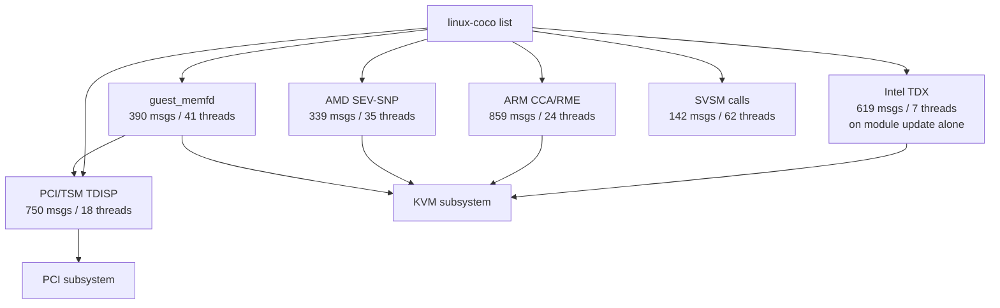

This wiki covers the **linux-coco** mailing list (`linux-coco@lists.linux.dev`), the central coordination point for confidential computing support in the Linux kernel. The archive mirrors at [lore.kernel.org/linux-coco](https://lore.kernel.org/linux-coco).

The corpus indexed here: **631 threads / ~9,800 messages**, from **2024-05-08** through **2026-05-27**[^src].

[^src]: Source: public-inbox git mirror at `https://lore.kernel.org/linux-coco/git/0.git`, indexed with public-inbox 1.9.0.

## What is linux-coco?

`linux-coco` is the upstream kernel mailing list for patches, RFCs, and design discussion related to **Confidential Computing** (CoCo) — the umbrella term for hardware-isolated VM environments backed by Intel TDX, AMD SEV-SNP, and ARM CCA. It is cross-vendor and cross-architecture, covering both host-side kernel support and guest-side drivers.

## Key Findings

| # | Finding | Sources |
|---|---|---|
| 1 | **TDX Runtime Module Update** reached v10 targeting merge in kernel 7.2 — the first non-reboot TDX firmware update path, preserving running TDs. | [TDX Module Update](entities/patches/tdx-module-update.md) |
| 2 | **ARM CCA in KVM** reached v14 with RMM v2.0-bet1, range-based RMI APIs, and RMI init moved out of KVM — largest ARM-side milestone in the archive. | [ARM CCA in KVM](entities/patches/arm-cca-kvm.md) |
| 3 | **PCI/TSM (TDISP)** infrastructure merged into `tsm.git#next` in v3, establishing a vendor-agnostic kernel API for attesting PCIe devices in CoCo VMs. | [PCI/TDISP](concepts/pci-tdisp.md) |
| 4 | **guest_memfd in-place conversion** reached v7 with a new guest_memfd-native ioctl for per-page shared/private attributes — foundation for huge-page support. | [guest_memfd](concepts/guest-memfd.md) |
| 5 | **TDX Module Extensions + DICE-based TDX Quoting** RFC introduces a new Extension SEAMCALL framework (~50 MB memory) enabling complex in-module flows, with DICE attestation as the first user. | [Intel TDX](concepts/tdx.md) |

## Mailing List Structure

## Topics

### Concepts

| Page | Summary |
|---|---|
| [Intel TDX](concepts/tdx.md) | Trust Domain Extensions — Intel's TEE for guest VMs |
| [AMD SEV-SNP](concepts/sev-snp.md) | Secure Encrypted Virtualization — AMD's CoCo technology |
| [ARM CCA](concepts/arm-cca.md) | Confidential Compute Architecture — ARM's Realm VMs |
| [SVSM](concepts/svsm.md) | Secure VM Service Module — AMD's in-VM security service layer |
| [TSM Framework](concepts/tsm-framework.md) | Trusted Security Module — the kernel's cross-vendor CoCo API |
| [guest_memfd](concepts/guest-memfd.md) | Private memory management for confidential VMs |
| [PCI/TDISP](concepts/pci-tdisp.md) | PCIe device attestation for CoCo VMs |

### Active Patch Series

| Page | Status | Messages |
|---|---|---|
| [TDX Module Update](entities/patches/tdx-module-update.md) | v8 → kernel 7.2 | 619 |
| [TDX Dynamic PAMT](entities/patches/tdx-dynamic-pamt.md) | RFC v5 | 451 |
| [ARM CCA in KVM](entities/patches/arm-cca-kvm.md) | RFC (RMM v2.0-beta) | 478 |
| [PCI/TSM TDISP](entities/patches/pci-tsm-tdisp.md) | v3 in tsm.git#next | 750 |
| [guest_memfd In-Place Conversion](entities/patches/guest-memfd-inplace.md) | v6, near merge | 120 |

### Key Contributors

| Page | Org | Role |
|---|---|---|
| [Dan Williams](entities/people/dan-williams.md) | Intel | PCI/TSM, TSM framework lead |
| [Chao Gao](entities/people/chao-gao.md) | Intel | TDX module update lead |
| [Steven Price](entities/people/steven-price.md) | Arm | ARM CCA in KVM lead |
| [Sean Christopherson](entities/people/sean-christopherson.md) | Google | KVM maintainer, key TDX/SEV reviewer |
| [Ackerley Tng](entities/people/ackerley-tng.md) | (Google) | guest_memfd in-place conversion lead |

## Source Inventory

- **Total threads (24 months):** 602 (271 from May 2024–May 2025 + 331 from May 2025–May 2026)
- **Total messages:** 9,235
- **Date range:** 2024-05-08 → 2026-05-08
- **Most active areas (year 2):** ARM CCA (859 msgs), TDX module update (619), PCI/TSM (750), guest_memfd (390)
- **Most active areas (year 1):** Secure VFIO/TDISP RFC (128), TDX kexec (115+57), TDX MMIO (109), ARM CCA KVM (multiple revisions)

## Recent Updates

- **2026-05-08** — extended wiki coverage to 24 months (added 271 threads / 3,753 messages from May 2024–May 2025).
- **2026-05-08** — initial wiki ingest from public-inbox mirror (331 threads / 5,482 messages).
