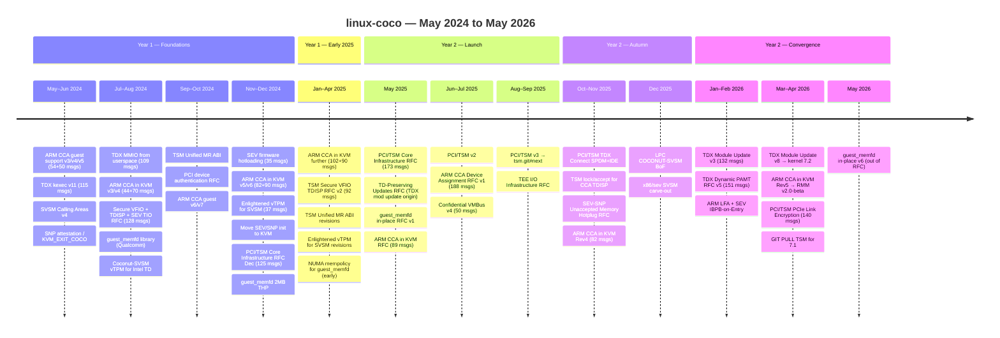

Twenty-four months of upstream Linux CoCo development across three TEE architectures: Intel TDX kexec lands, ARM CCA gains both guest and host support, AMD gets SVSM vTPM and firmware hotloading, and the PCI/TSM TDISP framework evolves from a 21-patch RFC to a merged infrastructure.

## May–June 2024 — Foundations

The list enters 2024 with three parallel foundational efforts:

- **TDX kexec v11** (115 messages, Kirill Shutemov) — after ten earlier revisions, v11 adds kexec/crashkernel support for TDX guests using CPU offlining per the ACPI spec. Key callbacks handle memory encryption/decryption during kexec transition. Final review focused on CR4.MCE preservation and single-CPU fallback[^tdxkexec].
- **ARM CCA guest support** — Steven Price posts v3/v4/v5 of the Linux guest driver for running inside an ARM CCA Realm, implementing RSI (Realm Service Interface) and new `RIPAS_IO` state for protected MMIO. A separate series from the host KVM side[^ccaguest].
- **SVSM Calling Areas v4** (Tom Lendacky) — replaces hardcoded boot-area addresses with kernel-provided SVSM Calling Areas for SEV-SNP guest-to-SVSM communication[^svsmcalling].
- **SNP attestation / KVM_EXIT_COCO** — Michael Roth's series adds KVM support for SNP Guest Requests per GHCB 2.0, exposing attestation to userspace via a new `KVM_EXIT_COCO` mechanism without requiring firmware cert tables[^snpattest].

## July–August 2024 — Device Security and Memory

The summer is the most eventful period of Year 1:

- **TDX MMIO from userspace** (109 messages, Alexey Gladkov) — extends TDX MMIO handling to userspace processes (previously kernel-only), critical for userspace device passthrough. Refactors `handle_mmio()` into separate read/write paths with enhanced memory validation[^tdxmmio].
- **Secure VFIO + TDISP + SEV TIO RFC** (128 messages, Alexey Kardashevskiy) — the 21-patch RFC that seeds the entire PCI/TSM effort: enables secure PCI passthrough to CoCo VMs on AMD Turin via SEV-TIO, introducing a new `tsm.ko` module and CCP interface. This RFC directly evolves into Dan Williams's PCI/TSM series[^securevfio].
- **VFIO dma-buf for private memory** (95 messages) — companion RFC creating host-inaccessible DMA-BUF objects for private devices in CoCo VMs, enabling secure device passthrough while maintaining memory isolation[^vfiodmabuf].
- **ARM CCA in KVM v3/v4** — Steven Price posts v3 (44 msgs) and v4 (70 msgs) of the host-side KVM CCA series against RMM v1.0-rel0-rc1, based on v6.11-rc1[^ccakvm-aug].
- **guest_memfd library** (41 messages, Elliot Berman / Qualcomm) — abstracts KVM's guest_memfd core-mm logic into a reusable library for multi-hypervisor use (KVM, Gunyah, pKVM, CCA). 427-line library enabling cross-platform confidential memory management[^gmemlib].
- **Coconut-SVSM vTPM for Intel TD Partitioning** (23 messages) — extends COCONUT-SVSM's vTPM service to run inside Intel TDX "TD Partitioning" (a nested TD containing an SVSM-like layer)[^tdvtpm].

## September–October 2024 — TSM Measurement Registers

- **TSM Unified MR ABI** (36 messages, Cedric Xing) — proposes a unified `/sys/kernel/tsm/` sysfs interface for measurement registers (MRs) across all CoCo platforms — static (build-time, read-only) and runtime (extensible, zero at boot). Predecessor to the `tsm-mr` work that appears in 2025[^tsmrm].
- **PCI device authentication** (86 messages) — earlier RFC for the SPDM/CMA authentication layer that later becomes part of PCI/TSM[^pciauth].
- **ARM CCA guest** continued revisions — v6/v7 iterations refining the Realm guest driver (RIPAS handling, RSI updates)[^ccaguest2].
- **swiotlb throttling RFC** (43 messages) — addresses SWIOTLB bounce-buffer exhaustion in CoCo contexts where encrypted DMA traffic cannot use the standard DMA path[^swiotlb].

## November–December 2024 — SVSM vTPM and SEV Restructuring

A busy end to Year 1:

- **SEV firmware hotloading** (35 messages, Dionna Glaze) — implements SNP firmware updates at runtime via `firmware_upload` API, with pre-commit writeback/flush and GCTX page updates. DOWNLOAD_FIRMWARE_EX support with auto-restore on failure[^sevhot].
- **ARM CCA in KVM v5/v6** (82+90 messages) — continued iteration; v6 (December) is a significant revision with improved memory management[^ccakvm-dec].
- **Enlightened vTPM for SVSM on SEV-SNP** (37 messages, Stefano Garzarella / Claudio Imbrenda) — generic vTPM platform driver using SVSM_VTPM_QUERY/SVSM_VTPM_CMD calls to the SVSM, tested with COCONUT-SVSM for sealing LUKS keys. Mature and upstream-ready by December[^svsmvtpm].
- **Move SEV/SNP init to KVM** (32 messages, Ashish Kalra) — restructures SEV/SNP platform initialization from the PSP driver into KVM, enabling on-demand init, firmware hotloading integration, and non-SNP VM operation without SEV overhead[^sevkvm].
- **PCI/TSM Core Infrastructure RFC** (125 messages, Dan Williams) — the December posting of Dan Williams's vendor-neutral TDISP framework, directly building on the August Secure VFIO RFC. This is the series that evolves through 2025[^pcicore-dec].
- **guest_memfd 2MB THP** (24 messages) — adds Transparent Huge Page support to guest_memfd backing store, a prerequisite for the in-place conversion series[^gmemthp].

## January–April 2025 — Convergence before the May Burst

- **ARM CCA in KVM** continues with two more large revisions (102 and 90 messages) as the series matures toward RMM v1.x[^ccakvm-early25].
- **TSM Secure VFIO TDISP RFC v2** (92 messages, Alexey Kardashevskiy) — the AMD TIO-focused counterpart to Dan Williams's PCI/TSM series, submitted in February 2025, triggering significant cross-vendor design discussion[^securevfio2].
- **TSM Unified MR ABI** further revisions (42 messages) — continued push to standardize the measurement register sysfs interface[^tsmrm2].
- **Enlightened vTPM for SVSM** — three more revision threads (45+33+30 messages) as the series approaches upstreamability.
- **NUMA mempolicy for guest_memfd** — early RFC iterations (19+20+14 messages) from the guest_memfd bi-weekly call[^numagmem].

---

*(For May 2025 onwards, see the detailed per-month narrative below.)*

## May 2025 — Three simultaneous RFCs

Three major RFCs land simultaneously[^pci-rfc][^tdrfc][^gmemfd-rfc][^cca-rfc]. → *See previous timeline entries.*

## June–July 2025 — ARM CCA Device Assignment and Confidential VMBus

[^cca-dev][^vmbus][^pci-v3]. → *See previous timeline entries.*

## August–September 2025 — PCI/TSM Merges into Next

[^pci-v3][^tee-io-rfc]. → *See previous timeline entries.*

## October–November 2025 — TDISP Backend Work

[^tdxconnect][^tsm-connect][^tsm-lock][^snphotplug][^svsm-spec].

## December 2025 — LPC and Reorganization

[^lpc][^svsm-carve].

## January 2026 — Combined PAMT + TDX acceleration

[^pamt-v5][^tdxv3][^lfa][^ibpb].

## February–March 2026 — Spring Convergence

[^cca-v5][^rmpopt][^tee-io-v2].

## April 2026 — v8 and GIT PULL

[^tdxv8][^linkenc][^gitpull][^gmemfd-v5][^cca-dev-v4][^cca-mr].

## May 2026 — guest_memfd v6

[^gmemfd-v6].

---

[^tdxkexec]: [20240528-x86tdx-add-kexec-support.md](threads/20240528-x86tdx-add-kexec-support.md)
[^ccaguest]: [20240819-arm64-support-for-running-as-a-guest-in-arm-cca.md](threads/20240819-arm64-support-for-running-as-a-guest-in-arm-cca.md)
[^svsmcalling]: [20240508-x86sev-use-kernel-provided-svsm-calling-areas.md](threads/20240508-x86sev-use-kernel-provided-svsm-calling-areas.md)
[^snpattest]: [20240621-sev-snp-add-kvm-support-for-attestation-and-kvm-exit-coco.md](threads/20240621-sev-snp-add-kvm-support-for-attestation-and-kvm-exit-coco.md)
[^tdxmmio]: [20240730-x86tdx-allow-mmio-instructions-from-userspace.md](threads/20240730-x86tdx-allow-mmio-instructions-from-userspace.md)
[^securevfio]: [20240823-rfc-patch-0021-secure-vfio-tdisp-sev-tio.md](threads/20240823-rfc-patch-0021-secure-vfio-tdisp-sev-tio.md)
[^vfiodmabuf]: [20240618-rfc-patch-0812-vfiopci-create-host-unaccessible-dma-buf-for.md](threads/20240618-rfc-patch-0812-vfiopci-create-host-unaccessible-dma-buf-for.md)
[^ccakvm-aug]: [20240821-arm64-support-for-arm-cca-in-kvm.md](threads/20240821-arm64-support-for-arm-cca-in-kvm.md)
[^gmemlib]: [20240805-mm-introduce-guest-memfd-library.md](threads/20240805-mm-introduce-guest-memfd-library.md)
[^tdvtpm]: [20240703-coconut-svsm-vtpm-support-for-intel-td-partitioning.md](threads/20240703-coconut-svsm-vtpm-support-for-intel-td-partitioning.md)
[^tsmrm]: [20240907-tsm-unified-measurement-register-abi-for-tvms.md](threads/20240907-tsm-unified-measurement-register-abi-for-tvms.md)
[^pciauth]: [20240630-pci-device-authentication.md](threads/20240630-pci-device-authentication.md)
[^ccaguest2]: [20241004-arm64-support-for-running-as-a-guest-in-arm-cca.md](threads/20241004-arm64-support-for-running-as-a-guest-in-arm-cca.md)
[^swiotlb]: [20240822-rfc-07-introduce-swiotlb-throttling.md](threads/20240822-rfc-07-introduce-swiotlb-throttling.md)
[^sevhot]: [20241107-add-sev-firmware-hotloading.md](threads/20241107-add-sev-firmware-hotloading.md)
[^ccakvm-dec]: [20241212-arm64-support-for-arm-cca-in-kvm.md](threads/20241212-arm64-support-for-arm-cca-in-kvm.md)
[^svsmvtpm]: [20241210-enlightened-vtpm-support-for-svsm-on-sev-snp.md](threads/20241210-enlightened-vtpm-support-for-svsm-on-sev-snp.md)
[^sevkvm]: [20241216-move-initializing-sevsnp-functionality-to-kvm.md](threads/20241216-move-initializing-sevsnp-functionality-to-kvm.md)
[^pcicore-dec]: [20241205-pcitsm-core-infrastructure-for-pci-device-security.md](threads/20241205-pcitsm-core-infrastructure-for-pci-device-security.md)
[^gmemthp]: [20241212-kvm-gmem-2mb-thp-support-and-preparedness-tracking-changes.md](threads/20241212-kvm-gmem-2mb-thp-support-and-preparedness-tracking-changes.md)
[^ccakvm-early25]: [20250213-arm64-support-for-arm-cca-in-kvm.md](threads/20250213-arm64-support-for-arm-cca-in-kvm.md)
[^securevfio2]: [20250218-rfc-patch-v2-0022-tsm-secure-vfio-tdisp-sev-tio.md](threads/20250218-rfc-patch-v2-0022-tsm-secure-vfio-tdisp-sev-tio.md)
[^tsmrm2]: [20250212-tsm-unified-measurement-register-abi-for-tvms.md](threads/20250212-tsm-unified-measurement-register-abi-for-tvms.md)
[^numagmem]: [20250226-add-numa-mempolicy-support-for-kvm-guest-memfd.md](threads/20250226-add-numa-mempolicy-support-for-kvm-guest-memfd.md)
[^pci-rfc]: [20250515-pcitsm-core-infrastructure-for-pci-device-security-tdisp.md](threads/20250515-pcitsm-core-infrastructure-for-pci-device-security-tdisp.md)
[^tdrfc]: [20250523-rfc-patch-0020-td-preserving-updates.md](threads/20250523-rfc-patch-0020-td-preserving-updates.md)
[^gmemfd-rfc]: [20250612-kvm-guest-memfd-support-in-place-conversion-for-coco-vms.md](threads/20250612-kvm-guest-memfd-support-in-place-conversion-for-coco-vms.md)
[^cca-rfc]: [20250611-arm64-support-for-arm-cca-in-kvm.md](threads/20250611-arm64-support-for-arm-cca-in-kvm.md)
[^cca-dev]: [20250728-rfc-patch-v1-0038-arm-cca-device-assignment-support.md](threads/20250728-rfc-patch-v1-0038-arm-cca-device-assignment-support.md)
[^vmbus]: [20250714-confidential-vmbus.md](threads/20250714-confidential-vmbus.md)
[^pci-v3]: [20250826-pcitsm-core-infrastructure-for-pci-device-security-tdisp.md](threads/20250826-pcitsm-core-infrastructure-for-pci-device-security-tdisp.md)
[^tee-io-rfc]: [20250826-pcitsm-tee-io-infrastructure.md](threads/20250826-pcitsm-tee-io-infrastructure.md)
[^tdxconnect]: [20251117-pcitsm-tdx-connect-spdm-session-and-ide-establishment.md](threads/20251117-pcitsm-tdx-connect-spdm-session-and-ide-establishment.md)
[^tsm-connect]: [20251027-coc-tsm-implement-connect-disconnect-callbacks-for-arm-cca-i.md](threads/20251027-coc-tsm-implement-connect-disconnect-callbacks-for-arm-cca-i.md)
[^tsm-lock]: [20251117-tsm-implement-lock-accept-callbacks-for-arm-cca-tdisp-setup.md](threads/20251117-tsm-implement-lock-accept-callbacks-for-arm-cca-tdisp-setup.md)
[^snphotplug]: [20251125-rfc-patch-04-sev-snp-unaccepted-memory-hotplug.md](threads/20251125-rfc-patch-04-sev-snp-unaccepted-memory-hotplug.md)
[^svsm-spec]: [20251003-svsm-draft-specification-v101-draft-3.md](threads/20251003-svsm-draft-specification-v101-draft-3.md)
[^lpc]: [20251213-reminder-coconut-svsm-bof-at-lpc-on-sat-3pm.md](threads/20251213-reminder-coconut-svsm-bof-at-lpc-on-sat-3pm.md)
[^svsm-carve]: [20251204-x86sev-carve-out-the-svsm-support-code.md](threads/20251204-x86sev-carve-out-the-svsm-support-code.md)
[^pamt-v5]: [20260128-rfc-patch-v5-0045-tdx-dynamic-pamt-s-ept-hugepage.md](threads/20260128-rfc-patch-v5-0045-tdx-dynamic-pamt-s-ept-hugepage.md)
[^tdxv3]: [20260123-runtime-tdx-module-update-support.md](threads/20260123-runtime-tdx-module-update-support.md)
[^lfa]: [20260119-arm-live-firmware-activation-lfa-support.md](threads/20260119-arm-live-firmware-activation-lfa-support.md)
[^ibpb]: [20260126-kvm-sev-add-support-for-ibpb-on-entry.md](threads/20260126-kvm-sev-add-support-for-ibpb-on-entry.md)
[^cca-v5]: [20260318-arm64-support-for-arm-cca-in-kvm.md](threads/20260318-arm64-support-for-arm-cca-in-kvm.md)
[^rmpopt]: [20260302-add-rmpopt-support.md](threads/20260302-add-rmpopt-support.md)
[^tee-io-v2]: [20260302-pcitsm-tee-io-infrastructure.md](threads/20260302-pcitsm-tee-io-infrastructure.md)
[^tdxv8]: [20260427-runtime-tdx-module-update-support.md](threads/20260427-runtime-tdx-module-update-support.md)
[^linkenc]: [20260328-pcitsm-pcie-link-encryption-establishment-via-tdx-platform-s.md](threads/20260328-pcitsm-pcie-link-encryption-establishment-via-tdx-platform-s.md)
[^gitpull]: [20260426-git-pull-trusted-security-manager-pcie-tsm-update-for-71.md](threads/20260426-git-pull-trusted-security-manager-pcie-tsm-update-for-71.md)
[^gmemfd-v5]: [20260428-guest-memfd-in-place-conversion-support.md](threads/20260428-guest-memfd-in-place-conversion-support.md)
[^cca-dev-v4]: [20260427-rfc-patch-v4-0014-cocotsm-host-side-arm-cca-ide-setup-via-co.md](threads/20260427-rfc-patch-v4-0014-cocotsm-host-side-arm-cca-ide-setup-via-co.md)
[^cca-mr]: [20260414-arm64virt-add-arm-cca-measurement-register-support.md](threads/20260414-arm64virt-add-arm-cca-measurement-register-support.md)
[^gmemfd-v6]: [20260507-guest-memfd-in-place-conversion-support.md](threads/20260507-guest-memfd-in-place-conversion-support.md)

## See Also

- [Overview](overview.md)
- [Intel TDX](concepts/tdx.md)
- [ARM CCA](concepts/arm-cca.md)
- [PCI/TDISP](concepts/pci-tdisp.md)
- [guest_memfd](concepts/guest-memfd.md)
