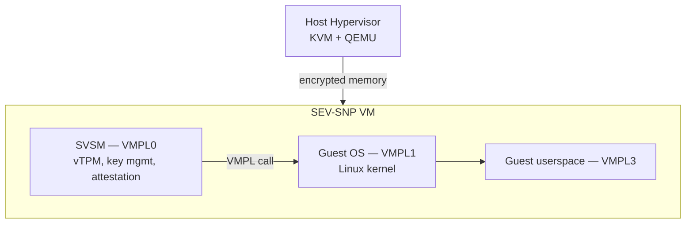

**SVSM (Secure VM Service Module)** is a firmware component that runs inside an AMD SEV-SNP virtual machine at the highest guest privilege level (VMPL0). It provides trusted services — vTPM, filesystem encryption, remote attestation, key management — to the guest OS running at lower privilege levels (VMPL1+). Because SVSM runs in the same encrypted VM, the host has no visibility into its operation.

## Architecture

SEV-SNP introduces **VMPL (VM Privilege Levels)** — four privilege levels within a single VM, analogous to CPU rings but with hardware enforcement. VMPL0 can control what VMPL1 sees.

**VMPL0 superpowers**: can set/revoke page permissions for VMPL1+, intercept certain VMGEXIT calls, and make RMP-level decisions. This allows SVSM to be the guest's trusted base without needing host involvement.

## COCONUT-SVSM

The primary open-source SVSM implementation is **COCONUT-SVSM** (maintained at `coconut-project/coconut-svsm` on GitHub). It is written in Rust and developed primarily by engineers at SUSE, AMD, and others.

Development release cadence tracked on linux-coco: monthly `coconut-svsm-devel` releases[^coconut-devel]. Each release includes new service implementations, bug fixes, and spec compliance updates.

## Foundational Work (May 2024 – May 2025)

### SVSM Calling Areas and Guest Kernel Integration

The first year saw foundational work on getting the guest Linux kernel to correctly discover and use an SVSM. Key threads:

- `x86/sev: Use kernel-provided SVSM calling areas` (May 2024) — moved SVSM call buffers from BIOS-provided memory to kernel-allocated memory[^svsm-areas-2024]. (See also [AMD SEV-SNP](sev-snp.md).)
- `Provide SEV-SNP support for running under an SVSM` (Jun 2024) — wired guest Linux VMPL delegation paths for PVALIDATE, GHCB, and other VMPL-sensitive operations[^snp-under-svsm].
- `KVM: SEV-SNP support for running an SVSM` (Aug 2024 RFC) — host-side KVM changes to initialize VMPL0 with an SVSM image[^kvm-svsm-rfc].

### KVM vCPU per VMPL (SVSM Scheduling)

`[RFC PATCH] Extend SEV-SNP SVSM support with a KVM vCPU per VMPL` (Sep 2024) — proposes giving each VMPL level its own KVM virtual CPU object, allowing the SVSM at VMPL0 to run concurrently with the guest OS at VMPL1. The current model requires the SVSM to return control to the guest on the same vCPU; a dedicated VMPL0 vCPU would enable proper preemptive scheduling between SVSM and guest[^vcpu-vmpl].

### Enlightened vTPM for SVSM on SEV-SNP

`[RFC] Enlightened vTPM support for SVSM on SEV-SNP` (Nov 2024, Stefano Garzarella, Red Hat) — proposes a guest driver that communicates with the SVSM's vTPM service using an "enlightened" interface: instead of emulating the TPM TIS (legacy interface), the guest and SVSM exchange structured TPM2 command buffers directly over the VMPL call ABI[^evtpm-v1].

The approach avoids the overhead of TPM register emulation while staying compatible with the guest's TPM2 stack. Follow-on revision in December 2024 refined the command buffer layout[^evtpm-dec].

### COCONUT-SVSM vTPM for Intel TD Partitioning

`coconut-svsm: vTPM support for Intel TD Partitioning` (Jul 2024) — an unusual thread: COCONUT-SVSM normally runs in AMD SEV-SNP VMs, but Intel TDX supports a "TD partitioning" mode where a parent TD can host child TDs. This RFC explores running COCONUT-SVSM in an Intel parent TD to provide vTPM services to child TDs[^coconut-tdx]. Demonstrates cross-vendor interest in the SVSM model.

[^svsm-areas-2024]: [20240508-x86sev-use-kernel-provided-svsm-calling-areas.md](../../20240508-x86sev-use-kernel-provided-svsm-calling-areas.md)
[^snp-under-svsm]: [20240605-provide-sev-snp-support-for-running-under-an-svsm.md](../../20240605-provide-sev-snp-support-for-running-under-an-svsm.md)
[^kvm-svsm-rfc]: [20240827-rfc-patch-07-kvm-sev-snp-support-for-running-an-svsm.md](../../20240827-rfc-patch-07-kvm-sev-snp-support-for-running-an-svsm.md)
[^vcpu-vmpl]: [20240916-rfc-patch-05-extend-sev-snp-svsm-support-with-a-kvm-vcpu-per.md](../../20240916-rfc-patch-05-extend-sev-snp-svsm-support-with-a-kvm-vcpu-per.md)
[^evtpm-v1]: [20241106-rfc-03-enlightened-vtpm-support-for-svsm-on-sev-snp.md](../../20241106-rfc-03-enlightened-vtpm-support-for-svsm-on-sev-snp.md)
[^evtpm-dec]: [20241210-enlightened-vtpm-support-for-svsm-on-sev-snp.md](../../20241210-enlightened-vtpm-support-for-svsm-on-sev-snp.md)
[^coconut-tdx]: [20240704-coconut-svsm-vtpm-support-for-intel-td-partitioning.md](../../20240704-coconut-svsm-vtpm-support-for-intel-td-partitioning.md)

## linux-coco Activity (May 2025 – May 2026)

### Development Calls

The SVSM community holds **weekly development calls** that are recorded and posted to linux-coco as meeting minutes. Over the 12-month period, 50+ meeting minute threads appear, covering[^svsm-call]:
- COCONUT-SVSM implementation progress
- SVSM specification updates (v1.01)
- Integration with Linux kernel (VMPL call ABI, vTPM driver)
- AMD hardware enablement questions

### SVSM Specification v1.01 Draft #3

The SVSM specification is developed publicly. Draft #3 of v1.01 was posted for community review[^svsm-spec]. Key additions over v1.0:
- vTPM service formalization
- VMPL call protocol clarifications
- Reboot/execute flow specification (how SVSM handles guest reboot)

### KVM Planes with SVSM

`KVM Planes with SVSM on Linux v6.17` — an RFC exploring how KVM's "Planes" abstraction (multi-level VMM hierarchy) can be used to cleanly model the SVSM layer from the host KVM perspective[^svsm-planes]. Still experimental.

### SVSM Reboot/Execute

`One-pager on SVSM reboot/execute` — a design discussion on how SVSM should handle guest reboots: the SVSM must remain running while the guest kernel restarts, which requires coordination between KVM, SVSM, and the guest firmware[^svsm-reboot].

### vTPM Service Attestation Format

`SVSM devel: vTPM service attestation format update` — updates to how the SVSM's vTPM service provides its attestation evidence, aligning with the AMD Secure Processor attestation report format[^vtpm].

### Linux Kernel Carve-out

`x86/sev: Carve out the SVSM support code` — restructures the Linux kernel's SVSM-related code (VMPL call helpers, SVSM discovery) into a dedicated compilation unit, making it easier to extend and test in isolation[^svsm-carve].

[^coconut-devel]: [20250807-coconut-svsm-release-202508-devel.md](../../20250807-coconut-svsm-release-202508-devel.md)
[^svsm-call]: [20250701-svsm-development-call-july-2nd-2025.md](../../20250701-svsm-development-call-july-2nd-2025.md)
[^svsm-spec]: [20251003-svsm-draft-specification-v101-draft-3.md](../../20251003-svsm-draft-specification-v101-draft-3.md)
[^svsm-planes]: [20251022-kvm-planes-with-svsm-on-linux-v617.md](../../20251022-kvm-planes-with-svsm-on-linux-v617.md)
[^svsm-reboot]: [20251105-one-pager-on-svsm-reboot-execute.md](../../20251105-one-pager-on-svsm-reboot-execute.md)
[^vtpm]: [20250625-svsm-devel-vtpm-service-attestation-format-update.md](../../20250625-svsm-devel-vtpm-service-attestation-format-update.md)
[^svsm-carve]: [20251204-x86sev-carve-out-the-svsm-support-code.md](../../20251204-x86sev-carve-out-the-svsm-support-code.md)

## See Also

- [AMD SEV-SNP](sev-snp.md)
- [TSM Framework](tsm-framework.md)
