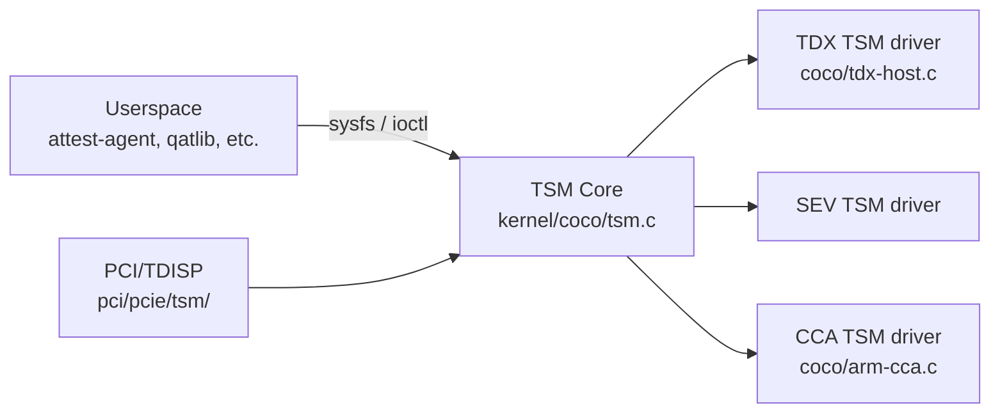

The **Trusted Security Module (TSM)** framework is the Linux kernel's vendor-neutral abstraction layer for interacting with TEE backends (TDX Module, AMD Secure Processor, ARM RMM). It provides a common sysfs and ioctl API so that userspace tools, guest drivers, and kernel subsystems (like PCI/TDISP) can work with any TEE without needing hardware-specific code paths.

## Foundational Work (May 2024 – May 2025)

### TSM Measurement Register ABI (2024)

The first major cross-vendor discussion in the archive. `TSM: Unified Measurement Register ABI for TVMs` (Sep 2024, Cedric Xing, Intel) — proposed a common `configfs` API for Trusted VM measurement registers: guest-side code calls a kernel interface to extend registers and read them back in attestation reports, vendor-agnostic[^tsm-mr-2024].

The design went through multiple rounds (October, December 2024, February 2025) as reviewers debated the register layout, the configfs path structure, and how it relates to the existing `tsm/report` interface[^tsm-mr-oct][^tsm-mr-dec]. The Feb 2025 revision reached rough consensus[^tsm-mr-feb25].

### TSM Report: TCB Stability

`configfs/tsm/report: TCB stability` (Sep 2024) — adds an API that lets an attestation relying party verify that the platform's Trusted Computing Base (TCB) version has not changed between two attestation report reads. Necessary for detecting mid-session firmware updates that would invalidate a previously verified TCB[^tcb-stable].

### TSM Configfs Measurement Read/Write (RFC v2)

`[RFC PATCH v2] TSM: Allow for extending and reading configurable measurement registers` (May 2024) — an earlier iteration of the MR ABI discussion, posted simultaneously with the `Authenticate devices via platform TSM` RFC (which became PCI/TDISP). This was the first combined TSM attestation + device authentication proposal[^tsm-cfg-v2].

### PCI/TSM: Device Authentication RFC (May 2024)

`[RFC PATCH v2 5/6] PCI/TSM: Authenticate devices via platform TSM` (May 2024) — a simultaneous early RFC posting the concept of extending the TSM framework to authenticate PCIe devices, posted alongside the MR RFC. This is the genesis of what became the full PCI/TDISP series[^pci-tsm-v2-2024]. See [PCI/TDISP](pci-tdisp.md) for the full evolution.

[^tsm-mr-2024]: [20240907-tsm-unified-measurement-register-abi-for-tvms.md](../../20240907-tsm-unified-measurement-register-abi-for-tvms.md)
[^tsm-mr-oct]: [20241031-tsm-unified-measurement-register-abi-for-tvms.md](../../20241031-tsm-unified-measurement-register-abi-for-tvms.md)
[^tsm-mr-dec]: [20241210-tsm-unified-measurement-register-abi-for-tvms.md](../../20241210-tsm-unified-measurement-register-abi-for-tvms.md)
[^tsm-mr-feb25]: [20250212-tsm-unified-measurement-register-abi-for-tvms.md](../../20250212-tsm-unified-measurement-register-abi-for-tvms.md)
[^tcb-stable]: [20240912-configfs-tsm-report-tcb-stability.md](../../20240912-configfs-tsm-report-tcb-stability.md)
[^tsm-cfg-v2]: [20240510-rfc-patch-v2-44-tsm-allow-for-extending-and-reading-configur.md](../../20240510-rfc-patch-v2-44-tsm-allow-for-extending-and-reading-configur.md)
[^pci-tsm-v2-2024]: [20240508-rfc-patch-v2-56-pcitsm-authenticate-devices-via-platform-tsm.md](../../20240508-rfc-patch-v2-56-pcitsm-authenticate-devices-via-platform-tsm.md)

## Components

### TSM Report (Attestation)

The TSM attestation interface exposes per-VM attestation reports via `/sys/kernel/config/tsm/report/`. A guest creates a configfs entry, writes an input blob (nonce / user data), and reads back the hardware-signed attestation report.

Supported backends: TDX TDREPORT, SEV-SNP attestation report, ARM CCA token.

### TSM Measurement Registers (MRs)

`sample/tsm-mr` and related patches add support for **Measurement Registers** — per-VM counters that record what software was loaded into the VM at boot (analogous to TPM PCRs). The TSM MR interface allows guest software to extend these registers and include them in attestation reports[^tsm-mr].

### TSM connect()/disconnect() Callbacks

`coc: tsm: Implement ->connect()/->disconnect() callbacks for ARM CCA TDISP setup`[^tsm-connect] — adds lifecycle callbacks to the TSM host-side driver interface, called when a PCIe device is being assigned to a CoCo VM. These allow the TSM backend to set up IDE (integrity and encryption) streams for the device.

### TSM lock()/accept() Callbacks

`TSM: Implement ->lock()/->accept() callbacks for ARM CCA TDISP setup`[^tsm-lock] — the guest-side counterpart: when the Realm VM accepts a device, it calls these callbacks to initiate the TDISP LOCK → RUN state transition, cryptographically binding the device to the Realm.

### GIT PULL: TSM updates for 6.16 / 7.1

`[GIT PULL] Trusted Security Manager (TSM) updates for 6.16`[^tsm-6.16] and `[GIT PULL] Trusted Security Manager PCIe TSM update for 7.1`[^tsm-7.1] — Dan Williams's periodic pull requests to merge TSM framework and PCI/TSM patches into the main kernel tree. These are the "graduation" events that move approved patches from `tsm.git#next` to `linux-next`.

### sample/tsm-mr: Use SHA-2 Library APIs

`sample/tsm-mr: Use SHA-2 library APIs` / `sample/tsm-mr: Fix missing static for sample_report`[^tsm-sha2] — maintenance patches to the TSM sample code, converting it from deprecated hash interfaces to the new SHA-2 library.

## MAINTAINERS Entry

The TSM subsystem is tracked in `MAINTAINERS` under `TRUSTED SECURITY MODULE (TSM)`. The `MAINTAINERS` entry update`[^tsm-maintainers] adds file coverage for the new `coco/` directory tree and `sample/tsm-mr/`.

[^tsm-mr]: [20250514-rfc-patch-v2-0722-cocotsm-add-tsm-and-tsm-host-modules.md](../../20250514-rfc-patch-v2-0722-cocotsm-add-tsm-and-tsm-host-modules.md)
[^tsm-connect]: [20251027-coc-tsm-implement-connect-disconnect-callbacks-for-arm-cca-i.md](../../20251027-coc-tsm-implement-connect-disconnect-callbacks-for-arm-cca-i.md)
[^tsm-lock]: [20251117-tsm-implement-lock-accept-callbacks-for-arm-cca-tdisp-setup.md](../../20251117-tsm-implement-lock-accept-callbacks-for-arm-cca-tdisp-setup.md)
[^tsm-6.16]: [20250426-git-pull-trusted-security-manager-pcie-tsm-update-for-71.md](../../20260426-git-pull-trusted-security-manager-pcie-tsm-update-for-71.md)
[^tsm-7.1]: [20260426-git-pull-trusted-security-manager-pcie-tsm-update-for-71.md](../../20260426-git-pull-trusted-security-manager-pcie-tsm-update-for-71.md)
[^tsm-sha2]: [20250508-sampletsm-mr-fix-missing-static-for-sample-report.md](../../20250508-sampletsm-mr-fix-missing-static-for-sample-report.md)
[^tsm-maintainers]: [20250509-maintainers-rectify-file-entries-in-trusted-security-module.md](../../20250509-maintainers-rectify-file-entries-in-trusted-security-module.md)

## See Also

- [PCI/TDISP](pci-tdisp.md)
- [Intel TDX](tdx.md)
- [AMD SEV-SNP](sev-snp.md)
- [ARM CCA](arm-cca.md)
