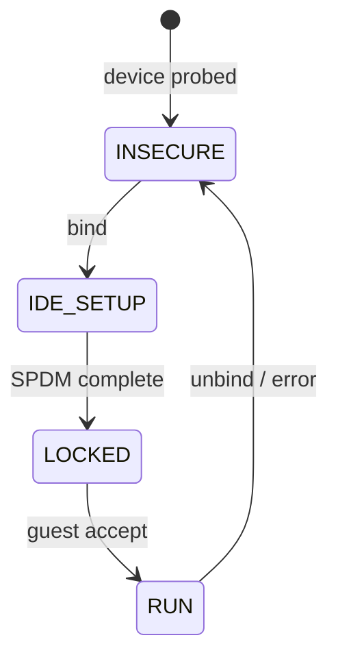

The **PCI/TSM: Core Infrastructure for PCI Device Security (TDISP)** series is Dan Williams's sustained effort to land a vendor-neutral kernel framework for PCIe device attestation in CoCo VMs. v3 landed in `tsm.git#next` by late 2025; a GIT PULL for 7.1 was issued in April 2026[^gitpull].

## Revision History

| Version | Date | Messages | Key Change |
|---|---|---|---|
| Secure VFIO RFC | Aug 2024 | 128 | AMD-led end-to-end TDISP/SEV-TIO prototype[^secure-vfio-aug] |
| PCI/TSM Core RFC | Dec 2024 | 125 | Dan Williams's first unified RFC[^pci-tsm-dec24] |
| Secure VFIO v2 | Feb 2025 | 92 | AMD RFC rebased on DW core[^secure-vfio-v2] |
| Core Mar 2025 | Mar 2025 | — | Second core revision[^pci-tsm-mar25] |
| RFC v1 | May 2025 | 173 | First upstream RFC |
| v2 | Jul 2025 | 74 | Refined API, IDE stream handling |
| v3 | Aug–Oct 2025 | 57+43 | Merged into tsm.git#next |
| GIT PULL (7.1) | Apr 2026 | — | Pull to upstream |

[^secure-vfio-aug]: [20240823-rfc-patch-0021-secure-vfio-tdisp-sev-tio.md](../../../20240823-rfc-patch-0021-secure-vfio-tdisp-sev-tio.md)
[^pci-tsm-dec24]: [20241205-pcitsm-core-infrastructure-for-pci-device-security-tdisp.md](../../../20241205-pcitsm-core-infrastructure-for-pci-device-security-tdisp.md)
[^secure-vfio-v2]: [20250218-rfc-patch-v2-0022-tsm-secure-vfio-tdisp-sev-tio.md](../../../20250218-rfc-patch-v2-0022-tsm-secure-vfio-tdisp-sev-tio.md)
[^pci-tsm-mar25]: [20250303-pcitsm-core-infrastructure-for-pci-device-security-tdisp.md](../../../20250303-pcitsm-core-infrastructure-for-pci-device-security-tdisp.md)

## What Is in the Series

The series establishes the **TSM host-side driver API** for PCI devices:

```
pci/pcie/tsm/
├── core.c          — TSM bus abstraction, device discovery
├── ide.c           — IDE stream management
├── spdm.c          — SPDM session establishment
└── sample/
    └── devsec/     — sample driver + test harness
```

### Operations

| Operation | Description |
|---|---|
| `bind` | Associate a PCIe device with a TEE context |
| `unbind` | Release the device from the TEE context |
| `guest_req` | Forwarded request from VM guest (via VFIO) to TSM |
| `accept` | Guest confirms device in RUN state |
| `connect` | TSM backend: begin IDE key setup |
| `disconnect` | TSM backend: tear down IDE session |

### IDE Stream Lifecycle



### Coordination Point: tsm.git#staging

Dan Williams maintains a public tree at `tsm.git#staging` (later `tsm.git#next`) that serves as the integration point for all vendor-specific TDISP backends (TDX Connect, SEV-TIO, ARM CCA) before they flow upstream. All backend series rebase on top of the core infrastructure here[^core-v3].

## Related Series

- **Host-side KVM/VFIO/IOMMUFD** (30 patches, 68 msgs)[^host-vfio]: wires VFIO passthrough and IOMMUFD into the TDISP flow.
- **TDX Connect** (SPDM + IDE)[^tdx-connect]: TDX backend hooks.
- **PCIe Link Encryption** (TDX platform services)[^link-enc]: full IDE key programming through TDX Module.
- **SEV-TIO phase 2**[^sev-tio]: AMD SEV backend.
- **TEE I/O infrastructure**[^tee-io]: guest-side netlink ABI and IORES_DESC_ENCRYPTED.
- **ARM CCA device assignment**[^cca-dev]: ARM Realm device attestation (RFC v4).

[^gitpull]: [20260426-git-pull-trusted-security-manager-pcie-tsm-update-for-71.md](../../../20260426-git-pull-trusted-security-manager-pcie-tsm-update-for-71.md)
[^core-v3]: [20250826-pcitsm-core-infrastructure-for-pci-device-security-tdisp.md](../../../20250826-pcitsm-core-infrastructure-for-pci-device-security-tdisp.md)
[^host-vfio]: [20250529-rfc-patch-0030-host-side-kvmvfioiommufd-support-for-tdisp-us.md](../../../20250529-rfc-patch-0030-host-side-kvmvfioiommufd-support-for-tdisp-us.md)
[^tdx-connect]: [20251117-pcitsm-tdx-connect-spdm-session-and-ide-establishment.md](../../../20251117-pcitsm-tdx-connect-spdm-session-and-ide-establishment.md)
[^link-enc]: [20260328-pcitsm-pcie-link-encryption-establishment-via-tdx-platform-s.md](../../../20260328-pcitsm-pcie-link-encryption-establishment-via-tdx-platform-s.md)
[^sev-tio]: [20260225-pcitsm-cocosev-guest-implement-sev-tio-pcie-tdisp-phase2.md](../../../20260225-pcitsm-cocosev-guest-implement-sev-tio-pcie-tdisp-phase2.md)
[^tee-io]: [20260302-pcitsm-tee-io-infrastructure.md](../../../20260302-pcitsm-tee-io-infrastructure.md)
[^cca-dev]: [20260427-rfc-patch-v4-0014-cocotsm-host-side-arm-cca-ide-setup-via-co.md](../../../20260427-rfc-patch-v4-0014-cocotsm-host-side-arm-cca-ide-setup-via-co.md)

## See Also

- [PCI/TDISP concept](../../concepts/pci-tdisp.md)
- [TSM Framework](../../concepts/tsm-framework.md)
- [Dan Williams](../people/dan-williams.md)
