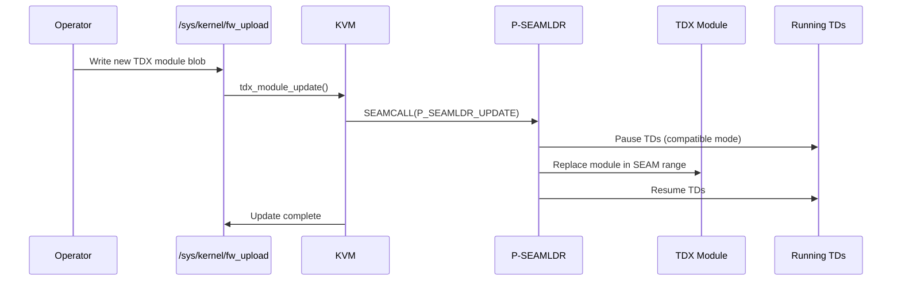

The **Runtime TDX Module Update** series enables live firmware update of the TDX Module — the signed software component at the heart of Intel TDX — without rebooting the system or destroying running Trust Domains. This was the single most active patch series on linux-coco from May 2025 through May 2026.

## Background

The TDX Module is loaded by BIOS into the SEAM range at boot. Under the original design, updating it required a full system reboot and destroyed all running TDs. For cloud operators running production workloads, this was operationally untenable.

The solution uses the **P-SEAMLDR** (Privileged SEAM Loader) — a separate, more stable firmware component that can update the TDX Module in-place using a Linux `fw_upload` mechanism, preserving running TDs through the update.

## Revision History

| Version | Date | Messages | Lead |
|---|---|---|---|
| RFC (TD-Preserving) | May 2025 | 64 | Chao Gao |
| v1 | Sep 2025 | 120 | Chao Gao |
| v2 | Oct/Nov 2025 | — | Chao Gao |
| v3–v5 | Jan–Feb 2026 | 132+115 | Chao Gao |
| v6–v7 | Mar 2026 | 80+85 | Chao Gao |
| **v8** | **Apr 2026** | **48** | **Chao Gao** |

Total: ~619 messages, 7 major revision threads.

## Technical Design

**fw_upload integration**: The kernel's `fw_upload` framework provides the `uploading / programming / done` state machine. The TDX update driver hooks into `fw_upload_ops.write()` to pass the blob to P-SEAMLDR.

**sysfs ABI** (v8, flattened): `/sys/devices/faux/tdx_host/`:
- `seamldr_version` — P-SEAMLDR version string
- `num_remaining_updates` — how many more updates the platform allows
- `fw_upload` — write to start an update

## Key Technical Issues Resolved Across Revisions

- **Race between update and TD build**: New TDs cannot be created during an update. v7/v8 adds `READ_ONCE()/WRITE_ONCE()` for the shared "failed" flag.
- **VMXON during update**: Must ensure all CPUs have completed `VMXON` before issuing the P-SEAMLDR update call. Resolved by serializing via `stop_machine()`.
- **TDX metadata refresh post-update**: v8 limits post-update checks to refreshing `update_version` only; broader re-checks were removed as unnecessary.
- **fw_upload error codes**: v8 maps TDX update errors to `FW_UPLOAD_ERR_BUSY` (contention during TD-build) or `FW_UPLOAD_ERR_INVALID_SIZE` (firmware integrity failure).
- **COMPAT flag on TDH.SYS.SHUTDOWN**: Always pass compat flag when tearing down TDX on error, to support cross-version operation.

## v8 Status

v8 was submitted in late April 2026 targeting **kernel 7.2**[^v8]. Key reviewer: Rick P Edgecombe (Intel). The series was substantially rewritten from v7: patches 08 and 15 were fully reworked; commit messages for 16 and 17 were tightened. Non-essential pieces (e.g., pre-emptive PAGE_SIZE != 4KB handling) were removed to keep the merge window scope minimal.

[^v8]: [20260427-runtime-tdx-module-update-support.md](../../../20260427-runtime-tdx-module-update-support.md)
[^v3]: [20260123-runtime-tdx-module-update-support.md](../../../20260123-runtime-tdx-module-update-support.md)
[^v1]: [20250930-runtime-tdx-module-update-support.md](../../../20250930-runtime-tdx-module-update-support.md)
[^rfc]: [20250523-rfc-patch-0020-td-preserving-updates.md](../../../20250523-rfc-patch-0020-td-preserving-updates.md)

## See Also

- [Intel TDX](../../concepts/tdx.md)
- [Chao Gao](../people/chao-gao.md)
