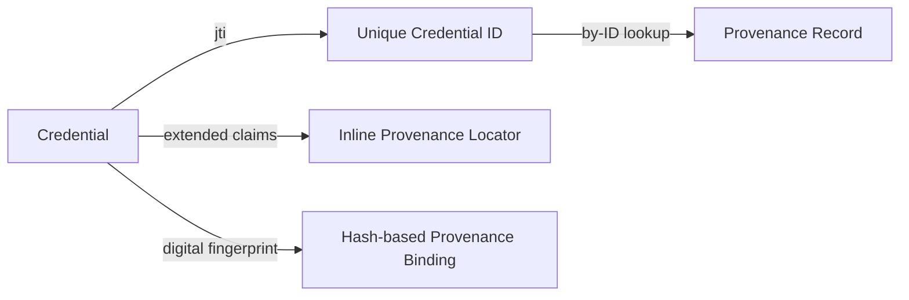

**Provenance** in TWI means the chain of evidence that says where a workload's code, configuration, and reference values *came from* — and binds that chain to the workload's credential. Inside the SIG, provenance has two distinct lives:

1. A **minimal** ask of WIMSE: "the credential has a unique ID; the rest is TBD between issuer and RP."
2. A **maximal** vision in the CCC TWI Reference Architecture: full chain-of-workloads thinking, "a mesh".

[Mateusz Bronk](../entities/people/mateusz-bronk.md) and [Mark Novak](../entities/people/mark-novak.md) drew that line in the [PR-33 discussion](https://github.com/confidential-computing/twi-wimse/pull/33) — strategic discipline to keep the IETF ask narrow[^pr33].

[^pr33]: [113881043-general-comment-on-pull-request-33.md](../../113881043-general-comment-on-pull-request-33.md)
## The minimal WIMSE ask

WIMSE's charter excludes provenance, so the IETF 123 informational draft was reduced to:

> "The provenance metadata required for a Trustworthy Workload Identity is compatible with existing WIMSE architecture. The WIMSE data formats and protocol support unique identifiers of the identity credentials (for example, a `jti` claim of the Workload Identity Token) and allow for extending the credential claims already. This will allow to bind TWI Workload Provenance and Workload Credential Provenance metadata to them without requiring any changes to WIMSE."[^pr33]

The "unique credential ID" hook is enough — the actual provenance lookup can be done out-of-band, async, or as a future extension.

## The maximal Reference Architecture view

Manu Fontaine reframed provenance in April 2026 after work on the Replica Workloads profile[^prov]:

> "The entire attestation verification chain ends up in the Attester workload's TCB. […] All bits originate from other workloads, it follows that we need to approach this as a recursive system architecture for workload chains. (Dare I say, a 'mesh' of workloads.)"

[^prov]: [118625119-let-39-s-discuss-provenance.md](../../118625119-let-39-s-discuss-provenance.md)
This connects provenance directly to [Trustworthy Composability](trustworthy-composability.md): if every bit your verification depends on came from another workload, then provenance and the recursive-trust architecture are the same problem.

## Where additional metadata could ride

Three options were on the table[^pr33]:
- **By-ID** lookup (the SIG's most-likely future direction).
- **Inline locator / claim** in the credential — useful when the RP / Verifier inspects provenance routinely.
- **Hash-based** binding — works even without a `jti`-style ID, since any digital record can be fingerprinted.

The SIG deliberately kept all three open in the IETF document.

## Adjacent threads

- **CCC TAC secure-coding & workload-administration guidelines** — a separate document the SIG advocated for, addressing how a verified workload's identity can be silently altered by post-attestation configuration changes (the "Grok unauthorized modification" example)[^seccoding].
- **Outreach: Wikipedia citation request** — Dan Middleton's Mar 2025 ask for citable references linking CC with software-supply-chain security[^outreach].

[^seccoding]: [113161461-ccc-tac-secure-coding-and-workload-administration-guidelines.md](../../113161461-ccc-tac-secure-coding-and-workload-administration-guidelines.md)
[^outreach]: [112008953-fw-twi-request-from-outreach-secure-s-w-supply-chain-referen.md](../../112008953-fw-twi-request-from-outreach-secure-s-w-supply-chain-referen.md)
## See also

- [Trustworthy Composability](trustworthy-composability.md)
- [TWI Informational Draft (IETF 123)](../entities/drafts/informational-draft-ietf-123.md)
- [WIMSE & TWI](wimse-and-twi.md)
