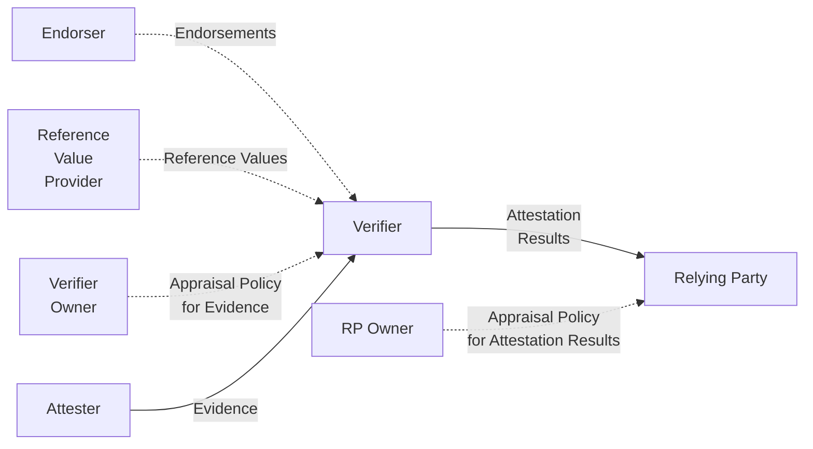

The IETF **RATS** working group (Remote ATtestation procedureS) defines the architecture and conceptual messages used in remote attestation. It is the parent context for most of the SIG's IETF work. The architecture itself is **RFC 9334**.

## Roles

| Role | What it does |
|---|---|
| **Attester** | The thing being attested. Produces Evidence about itself. In TWI, this is the workload in a TEE. |
| **Verifier** | Appraises Evidence against Reference Values + Appraisal Policy for Evidence; produces Attestation Results. |
| **Relying Party (RP)** | Consumes Attestation Results under Appraisal Policy for Attestation Results; decides whether to grant access. |
| **Endorser** | Issues endorsements about an Attesting Environment (e.g. chip vendor signing for a CPU). |
| **Reference Value Provider** | Supplies known-good measurements for the Verifier. |
| **Verifier Owner / RP Owner** | Operate / configure their components. |

## Why TWI cares

The SIG's view is that **credential issuance falls into a crack**[^crack]: WIMSE assumes credentials are obtained somehow; RATS describes the attestation flow but stops short of what to *do* with Attestation Results to issue a credential. TWI fills the gap:

- The [TWI Informational Draft (IETF 123)](../entities/drafts/informational-draft-ietf-123.md) describes the conditions under which a Confidential workload can express its identity in WIMSE-compatible ways.
- The [TWI eXchange Draft (IETF 124)](../entities/drafts/twi-exchange-draft.md) — `draft-novak-twi-attestation` — extends RATS with the message exchanges needed to issue credentials based on Attestation Results.
- The [Vienna submission](../entities/drafts/vienna-submission.md) extends the architecture itself with a new role: the [RATS-Unaware Relying Party](rats-unaware-relying-parties.md).

[^crack]: [118956224-fw-ccc-attestation-documents-from-today-39-s-presentation.md](../../118956224-fw-ccc-attestation-documents-from-today-39-s-presentation.md)
## Other RATS work the SIG tracks

| Draft | Why it matters | Source |
|---|---|---|
| `draft-ietf-rats-msg-wrap` (CMW — Conceptual Messages Wrapper) | Common envelope (CBOR tag, JWT/CWT claims, X.509 extension) for Evidence, Attestation Results, Endorsements, Reference Values. Potential building block for TWI message exchanges. | [^cmw] |
| `draft-ietf-rats-ar4si` (Attestation Results for Secure Interactions) | A richer Attestation-Results information model than what TWI proposes. Compatibility with WIMSE is unclear. | [^ar4si] |
| `draft-mihalcea-seat-use-cases` (SEAT) | Use-cases for attestation-bound credentials. Mark Novak's review noted it omits *manageability*, which is core to the TWI angle. | [^seat] |

[^cmw]: [114663896-conceptual-message-wrapper-cmw-ietf-draft-from-rats.md](../../114663896-conceptual-message-wrapper-cmw-ietf-draft-from-rats.md)
[^ar4si]: [114723280-ar4si-draft-from-rats.md](../../114723280-ar4si-draft-from-rats.md)
[^seat]: [116109344-mail-regarding-draft-mihalcea-seat-use-cases-one-key-quot-in.md](../../116109344-mail-regarding-draft-mihalcea-seat-use-cases-one-key-quot-in.md)
## See also

- [IETF RATS WG](../entities/orgs/ietf-rats.md)
- [RATS-Unaware Relying Parties](rats-unaware-relying-parties.md)
- [TWI eXchange Draft](../entities/drafts/twi-exchange-draft.md)
