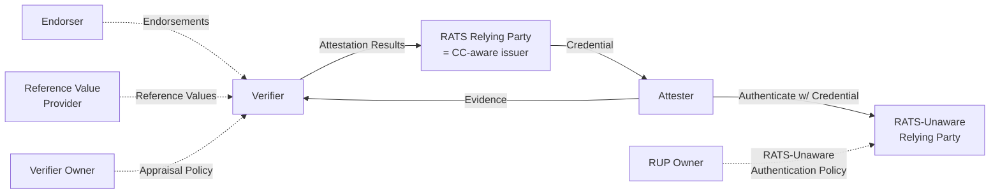

A **RATS-Unaware Relying Party (RUP)** is the SIG's term for a relying party that:

- Cannot process [RATS](rats-architecture.md) Attestation Results.
- Cannot execute Appraisal Policy for Attestation Results.
- *And will not change* to acquire those abilities.

The TWI position — articulated by [Mark Novak](../entities/people/mark-novak.md) for the IETF [Vienna submission](../entities/drafts/vienna-submission.md) (Apr 2026) — is that this category exists, is large, and that the RATS architecture must be **extended**, not assumed-away, to interoperate with it[^vienna].

[^vienna]: 118990275-early-draft-of-the-vienna-submission.md

## The deployability argument

> "Success of a technology is ultimately measured by its adoption. The RATS architecture, by requiring that Relying Parties understand Attestation Results and execute Appraisal Policy for Attestation Results, intrinsically limits adoption to Relying Parties that understand RATS protocols and standards. Additionally, the unstated assumption present in the RATS architecture that a change in Evidence may lead to a change in Attestation Results makes it impossible to manage Relying Parties whose authentication policies remain static for long periods of time."[^vienna]

A lot of focus, Mark argues, "has been placed outside of the needs of existing relying parties, and assuming that Relying Parties will change because of Confidential Computing. My assertion is many of them — enough to really matter — will not."[^vienna]

The SIG's evidence: there is currently **no way to integrate SPIFFE with CC**, and customers looking to adopt Confidential Computing find themselves "without options for their existing environments."[^vienna]

## The proposed mechanism

A RUP is unblocked if it can authenticate clients via standard proof-of-possession over credentials it already understands (X.509, WIMSE WITs). The architecture extension lets the RATS Relying Party (now acting as an issuer) hand the Attester one of:

1. A full credential matching an attested Attester-held asymmetric *signing* key, or
2. A signing key encrypted to an attested Attester-held asymmetric *encryption* key (the RP is then a Key Store; the credential itself was pre-provisioned).

## The Markus Rudy critique

[Markus Rudy](../entities/people/markus-rudy.md) (Edgeless Systems) pushed back twice in the same thread[^vienna]:

| Critique | Mark's response |
|---|---|
| "Nothing in the existing RATS model prescribes what the RP should do with Attestation Results. You're already free to implement an RP this way." | True in principle, but in practice implementors look at RATS, see no guidance, and do not provide this option. The architecture extension is what unblocks vendor implementations. |
| "RUPs don't need to be in the model at all — just make the IdP CC-aware and the RUPs never need to learn about CC." | Those CC-aware IdPs do not exist yet — *"these IdPs are nowhere to be found. There is currently no way to integrate SPIFFE with CC."* The draft is meant to initiate the dialog that produces them. |

This is the live design tension inside the SIG as of April 2026: whether the IETF deliverable should be an architecture extension (Mark) or remain on the issuer side without touching the architecture (Markus).

## See also

- [Vienna submission](../entities/drafts/vienna-submission.md) — the document this concept lives in
- [TWI Profile for Replica Workloads](../entities/drafts/twi-profile-replica-workloads.md) — the parent profile from which the Vienna submission narrows down
- [RATS architecture](rats-architecture.md)
