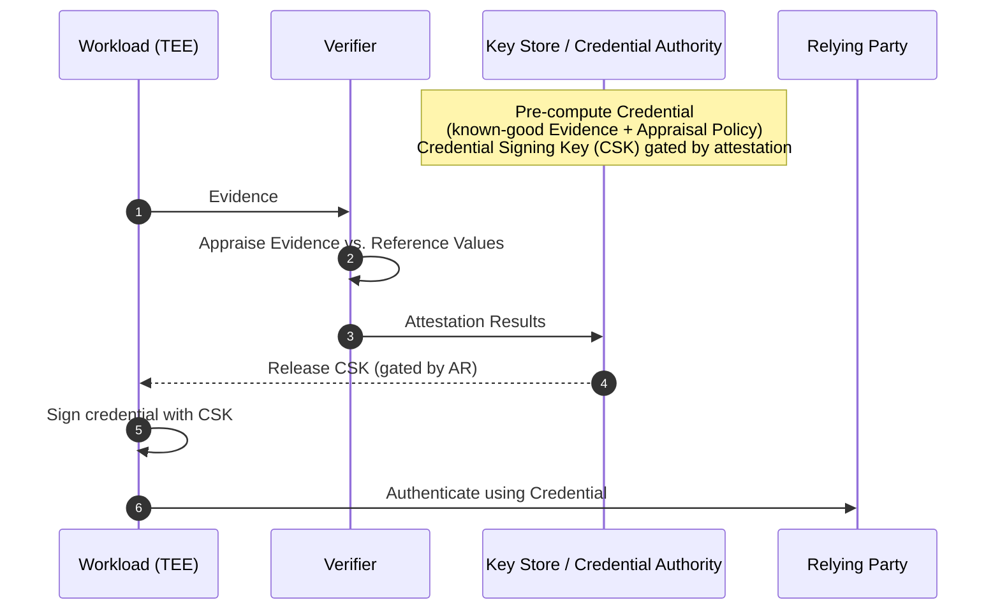

A **Replica Workload** is a workload that is functionally indistinguishable from its sibling instances from the point of view of clients and servers — the canonical examples are containers, AWS Lambda functions, and horizontally-scaling confidential VMs[^replica]. They all share the same code, security-sensitive configuration, and compliance attributes (e.g. location), and *they share an identity*.

The "TWI Profile for Replica Workloads" is the SIG's first concrete deliverable — finalised v1.0 in March 2026[^replica] and presented to the CCC TAC in April 2026.

[^replica]: [118596716-trustworthy-workload-identity-for-replica-workloads.md](../../118596716-trustworthy-workload-identity-for-replica-workloads.md)
## Naming history

| Date | Name | Trigger |
|---|---|---|
| 2026-01 | "horizontal scale-out" workloads / twin workloads | New-year planning post[^horiz] |
| 2026-03-03 | TWI Profile for **Twin Workloads** v1.0 — final review | [^twin] |
| 2026-03-31 | renamed to TWI Profile for **Replica Workloads** v1.0 | [^replica] |

[^horiz]: [117140104-trustworthy-workload-identity-for-horizontally-scaling-workl.md](../../117140104-trustworthy-workload-identity-for-horizontally-scaling-workl.md)
[^twin]: [118116641-final-review-twi-profile-for-twin-workloads.md](../../118116641-final-review-twi-profile-for-twin-workloads.md)
## Why this scope first

> "Replica workloads represent the lion's share of cloud-based computing, encompassing confidential VMs, containers and serverless functions that share identity with their replicas."[^replica]

Mark Novak's strategic argument: standardise the most common cloud deployment shape first, since "until this is implemented by CSPs and solution vendors, the proposal is just words on paper."[^replica]

## Core idea: precomputed credentials, key released on attestation

The **CSK release policy** can be updated alongside reference-value rollouts so that older versions of the workload lose access to the credential after a rollout completes — a security requirement, not a side-effect[^stability].

[^stability]: [118956224-fw-ccc-attestation-documents-from-today-39-s-presentation.md](../../118956224-fw-ccc-attestation-documents-from-today-39-s-presentation.md)
## What stays stable for the relying party

The whole point of the profile is that the **Relying Party sees the same credential** before and after a workload upgrade — *"a payroll app is a payroll app before and after, whether it is moving from legacy to confidential, or from one known-good version to another"*[^stability]. Two ways to achieve this:

1. **Verifier-as-Credential-Authority** — Attestation Results must remain unchanged for as long as Evidence is still "known good".
2. **Intermediary (Key Store) between Verifier and RP** — the Verifier may emit changing Attestation Results; the Key Store *contains* that volatility and presents the RP a stable credential.

The profile uses option (2)[^stability].

## "Anticipating Reference Values"

A precomputed credential requires knowing the Attestation Results *before* the workload runs[^antrv]. That means knowing in advance:

1. What Evidence the workload will present.
2. What Appraisal Policy will be applied to that Evidence.

Mark Novak forwarded this question to the IETF RATS list in April 2026 and is considering scoping the Vienna submission specifically around this aspect of the profile[^antrv].

[^antrv]: [118845083-fw-anticipating-reference-values.md](../../118845083-fw-anticipating-reference-values.md)
## See also

- [TWI Profile for Replica Workloads](../entities/drafts/twi-profile-replica-workloads.md) — the document itself
- [Vienna submission](../entities/drafts/vienna-submission.md) — derives from this profile
- [Trustworthy Workload Identity](trustworthy-workload-identity.md)
- [RATS architecture](rats-architecture.md)
