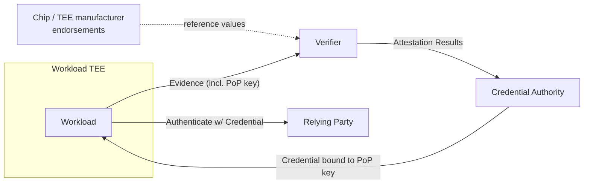

**Trustworthy Workload Identity (TWI)** is the SIG's name for a workload identity whose credentials are bound to *attestation evidence about the workload itself*, generated and produced from inside its TEE. The relying party trusts the code (and the chip that runs it), not an external "agent" that handed credentials to it.

The term "Trustworthy" is deliberate. WIMSE's existing notion of a workload identity says nothing about how the workload's attesting environment was actually verified — it can be issued by an external "Credentials Service" that took the workload's word for it. TWI inverts that: under Confidential Computing, the workload acquires its own credentials *because* it can prove what it is to a Verifier[^twivswimse].

[^twivswimse]: [113926112-twi-vs-wimse-recap.md](../../113926112-twi-vs-wimse-recap.md)
## What TWI is, in one diagram

The credential is **bound to a key that only the verified workload holds** (an asymmetric signing key whose public half is in the Evidence, or a key released only on successful attestation). That binding is what makes the identity *trustworthy* — possession of the credential proves the holder is the attested workload.

## What TWI is not

- **Not a new credential format.** TWI explicitly uses existing formats: WIMSE WITs (JWTs) and X.509 certificates. The point is *how they get issued*, not *what they look like*[^twixdraft].
- **Not "any TEE-issued credential."** The TWI profile requires the credential to have a unique credential-ID for provenance binding, and that the appraisal that produced it be tied to verifiable reference values[^prov33].
- **Not the same as Agent Identity** — see [Workload Identity vs. Agent Identity](workload-identity-vs-agent-identity.md). An agent represents *some entity* (user, org, another agent); the workload is the substrate the agent runs in.

[^twixdraft]: [115689796-first-draft-of-twi-exchange-draft-ready-for-review.md](../../115689796-first-draft-of-twi-exchange-draft-ready-for-review.md)
[^prov33]: [113881043-general-comment-on-pull-request-33.md](../../113881043-general-comment-on-pull-request-33.md)
## Required properties

| Property | Source of the requirement |
|---|---|
| Credential bound to attested PoP key | TWI Requirements (`github.com/confidential-computing/twi`)[^reqs] |
| Workload — not an external agent — performs attestation | TWI vs WIMSE recap — the "one thing we MUST get out of WIMSE"[^twivswimse] |
| Unique credential-ID for provenance | PR-33 discussion[^prov33] |
| Verifier and Reference-Value Provider must themselves be in TEEs (Hushmesh view) | "Composability" thread[^compose] |
| Stability under workload upgrades / rollbacks | Apr 2026 attestation-SIG presentation[^stability] |

[^reqs]: [113075164-twi-requirements-now-in-github.md](../../113075164-twi-requirements-now-in-github.md)
[^compose]: [114091547-thoughts-about-quot-composability-quot-and-strength-of-quot.md](../../114091547-thoughts-about-quot-composability-quot-and-strength-of-quot.md)
[^stability]: [118956224-fw-ccc-attestation-documents-from-today-39-s-presentation.md](../../118956224-fw-ccc-attestation-documents-from-today-39-s-presentation.md)
## Why "credential bootstrapping falls into the crack between WIMSE and RATS"

This is Mark Novak's framing[^crack]: WIMSE assumes the credential-issuance step is out of scope (the workload "obtains" credentials from a Credentials Service — but how?), while RATS describes the attestation flow but stops short of saying what to *do* with Attestation Results to issue a credential. TWI is the answer to the gap.

[^crack]: [118956224-fw-ccc-attestation-documents-from-today-39-s-presentation.md](../../118956224-fw-ccc-attestation-documents-from-today-39-s-presentation.md)
## See also

- [Replica & Twin Workloads](replica-and-twin-workloads.md) — the first concrete TWI profile, March 2026
- [TWI eXchange draft](../entities/drafts/twi-exchange-draft.md) — the IETF 124 draft
- [WIMSE & TWI](wimse-and-twi.md)
- [RATS architecture](rats-architecture.md)
