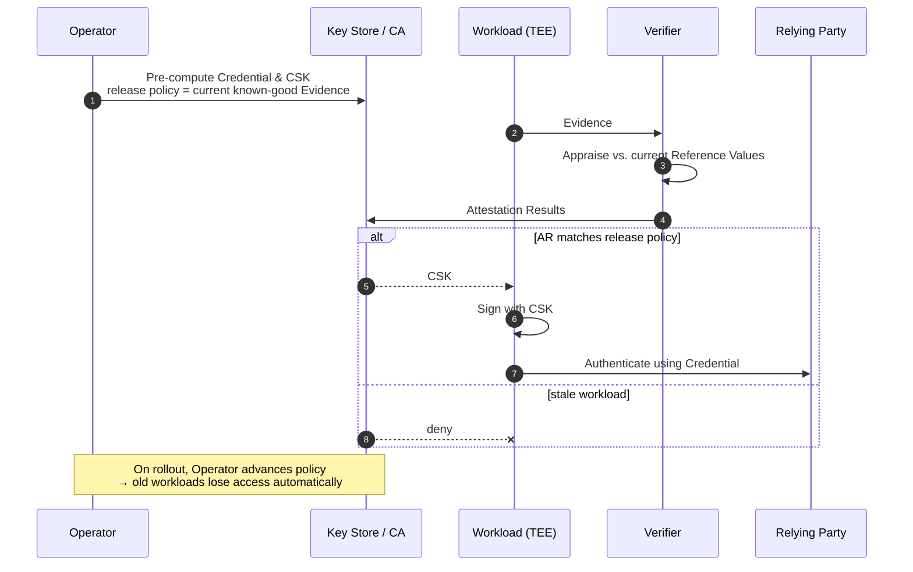

The SIG's first concrete technical profile, completed v1.0 in **March 2026**. Defines how a class of horizontally-scaling, identity-sharing workloads (containers, AWS Lambda functions, scaling confidential VMs) obtains industry-standard credentials based on Remote Attestation results.

## Quick facts

| | |
|---|---|
| **v1.0 final review** | 2026-03-03 ("Twin Workloads") [^twin] |
| **v1.0 rename → "Replica Workloads"** | 2026-03-31 [^replica] |
| **Working draft (Google Doc)** | https://docs.google.com/document/d/1hIBda3-MRgqrVY-Klv4vvlt0TNU1ibmiAtSddzXPO1c/ |
| **Presented to CCC TAC** | 2026-04-16 (Mark Novak), 15-min slot[^tac] |
| **Presented to CCC Attestation SIG** | 2026-04-21 [^attsig] |
| **Author** | Mark Novak |
| **Driving organisations** | CCC TWI SIG; followed by interest from WIMSE, RATS, Attestation SIG |

[^twin]: [118116641-final-review-twi-profile-for-twin-workloads.md](../../../118116641-final-review-twi-profile-for-twin-workloads.md)
[^replica]: [118596716-trustworthy-workload-identity-for-replica-workloads.md](../../../118596716-trustworthy-workload-identity-for-replica-workloads.md)
[^tac]: [118843190-please-review-tomorrow-39-s-draft-presentation.md](../../../118843190-please-review-tomorrow-39-s-draft-presentation.md)
[^attsig]: [118956224-fw-ccc-attestation-documents-from-today-39-s-presentation.md](../../../118956224-fw-ccc-attestation-documents-from-today-39-s-presentation.md)
## Why "replica"

The earlier name was "Twin Workloads", with a definition focused on *workloads that share code, security-sensitive configuration, and other compliance-relevant attributes such as location*[^twin]. Mark Novak renamed v1.0 to "Replica Workloads" by 2026-03-31[^replica]:

> "Replica workloads represent the lion's share of cloud-based computing, encompassing confidential VMs, containers and serverless functions that share identity with their replicas."

See [Replica & Twin Workloads](../../concepts/replica-and-twin-workloads.md) for the technical definition.

## Strategic positioning

Mark's pitch to Dan Middleton (CCC TAC) framed v1.0 as "a major milestone" and made the deployment ask explicit[^replica]:

> "We would like to present this work to the CCC TAC. The goal of the presentation would be to solicit input from consortium members on the contents of the document, but, more importantly, get to a point where this proposal is implemented by the CSPs and solution vendors. **Until this is done, the proposal is just words on paper.**"

A WIMSE-friendly framing was also chosen: per Mark's Jan 2026 "horizontal scale-out" post[^horiz], the WIMSE leadership had agreed this could be a **WIMSE profile with no architectural or design changes** — a deliberate "big win for interoperability" choice.

[^horiz]: [117140104-trustworthy-workload-identity-for-horizontally-scaling-workl.md](../../../117140104-trustworthy-workload-identity-for-horizontally-scaling-workl.md)
## Technical core (one-paragraph summary)

The profile pre-computes a credential for each known-good workload version and gates the **Credential Signing Key (CSK)** on attestation results: only a workload whose Evidence appraises against the *current* known-good policy gets the CSK. When a rollout completes the policy advances and older versions lose access[^attsig]. The relying party sees a stable credential throughout the rollout — that's the "Replica" property: the replicas all share identity from the RP's point of view.

## Open follow-ons after v1.0

| Topic | Where it goes | Source |
|---|---|---|
| "Anticipating Reference Values" — predicting AR before the workload runs | Submitted to RATS list 2026-04-15; possibly the Vienna submission focus | [^antrv] |
| RP stability under rollouts/rollbacks | Active discussion with the Attestation SIG — option (1) Verifier-as-CA, option (2) intermediary Key Store | [^attsig] |
| Provenance / chains of workloads | Spawned [Manu's mesh-of-workloads thread](../../concepts/provenance.md) | [^prov] |
| WIMSE / RATS interim presentations | Goal: submit revised IETF drafts in 2026 | [^horiz] |

[^antrv]: [118845083-fw-anticipating-reference-values.md](../../../118845083-fw-anticipating-reference-values.md)
[^prov]: [118625119-let-39-s-discuss-provenance.md](../../../118625119-let-39-s-discuss-provenance.md)
## See also

- [Replica & Twin Workloads](../../concepts/replica-and-twin-workloads.md)
- [Vienna submission](vienna-submission.md) — narrows scope from this profile
- [TWI eXchange draft](twi-exchange-draft.md) — predecessor that informs this profile
- [Mark Novak](../people/mark-novak.md), [Manu Fontaine](../people/manu-fontaine.md)
