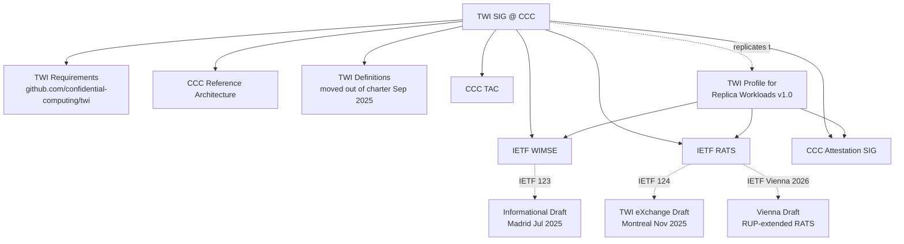

This wiki tracks the work of the **Trustworthy Workload Identity SIG** at the Confidential Computing Consortium (CCC). The SIG defines how workloads running in Trusted Execution Environments (TEEs) should obtain and present cryptographic identity, and feeds those ideas into IETF — primarily the [WIMSE](entities/orgs/ietf-wimse.md) and [RATS](entities/orgs/ietf-rats.md) working groups.

The corpus indexed here is the public groups.io mailing-list archive: **119 threads / 169 messages**, from the SIG's first post on **2025-03-31** through **2026-04-28**[^src].

[^src]: Source: 119 thread markdown files in this knowledge base, each derived from one [groups.io topic](https://lists.confidentialcomputing.io/g/Trustworthy-Workload-Identity-SIG).

## Scope

- **In:** TEE-based workload identity, attestation-driven credential issuance, replica/twin workloads, the RATS-Unaware Relying Party (RUP) extension, and the SIG's IETF and CCC TAC outputs.
- **Adjacent:** Provenance / supply-chain security; AI-agent identity; SPIFFE; the CCC Reference Architecture.
- **Out:** Internal CCC governance unrelated to TWI; non-CC workload identity in the general case (covered by WIMSE).

## Key Findings

| # | Finding | Sources |
|---|---|---|
| 1 | TWI's core technical contribution is a **profile for "replica workloads"** (containers, lambdas, horizontally-scaling VMs with shared identity). The Mar 2026 v1.0 was renamed twice: **twin → replica**[^twin][^replica]. | [TWI Profile for Replica Workloads](entities/drafts/twi-profile-replica-workloads.md) |
| 2 | The current (Apr 2026) IETF effort is the **Vienna submission**, which extends the RATS architecture with **RATS-Unaware Relying Parties (RUPs)** so Confidential Computing can interoperate with classical IdPs/RPs that won't change[^vienna]. | [Vienna submission](entities/drafts/vienna-submission.md), [RUPs concept](concepts/rats-unaware-relying-parties.md) |
| 3 | TWI is **mostly compatible with WIMSE** (post-PR-3 review). The one architectural ask is to invert the trust relationship so the workload — not an external "agent" — performs attestation and acquires its own credentials[^twivswimse]. | [WIMSE & TWI](concepts/wimse-and-twi.md) |
| 4 | The SIG explicitly chose **deployability over architectural purity**: the Vienna draft argues that asking existing relying parties to become "CC-aware" has historically blocked adoption, so the Attester-side mechanism for obtaining standard credentials is what needs standardising[^deploy]. | [RATS-Unaware Relying Parties](concepts/rats-unaware-relying-parties.md) |
| 5 | A recurring tension: Hushmesh's **Trustworthy Composability** view (verifiers/registries themselves must run in TEEs; entire chains must be trustworthy) vs. JPMorgan-style **risk-tolerated composability** (trust your CSP for some claims if your business risk allows it)[^compose]. | [Trustworthy Composability](concepts/trustworthy-composability.md) |

[^twin]: [118116641-final-review-twi-profile-for-twin-workloads.md](../118116641-final-review-twi-profile-for-twin-workloads.md)
[^replica]: [118596716-trustworthy-workload-identity-for-replica-workloads.md](../118596716-trustworthy-workload-identity-for-replica-workloads.md)
[^vienna]: [118990275-early-draft-of-the-vienna-submission.md](../118990275-early-draft-of-the-vienna-submission.md)
[^twivswimse]: [113926112-twi-vs-wimse-recap.md](../113926112-twi-vs-wimse-recap.md)
[^deploy]: [118990275-early-draft-of-the-vienna-submission.md](../118990275-early-draft-of-the-vienna-submission.md)
[^compose]: [114091547-thoughts-about-quot-composability-quot-and-strength-of-quot.md](../114091547-thoughts-about-quot-composability-quot-and-strength-of-quot.md)
## Structure of the Effort

## Source Inventory

- **Total threads:** 119 (`/`)
- **Total messages:** 169
- **Wiki pages:** see sub-trees below
- **Date range:** 2025-03-31 → 2026-04-28
- **Most active contributors:** [Mark Novak](entities/people/mark-novak.md) (chair, JPMorgan Chase), [Manu Fontaine](entities/people/manu-fontaine.md) (Hushmesh CEO). Other regulars: [Markus Rudy](entities/people/markus-rudy.md) (Edgeless Systems), [Henk Birkholz](entities/people/henk-birkholz.md) (RATS), [Yogesh Deshpande](entities/people/yogesh-deshpande.md) (Arm), [Mateusz Bronk](entities/people/mateusz-bronk.md) (Intel).

## Wiki Map

- **Concepts** (`/wiki/concepts/`)
  - [Trustworthy Workload Identity (TWI)](concepts/trustworthy-workload-identity.md) — what TWI means and why CC needs it
  - [Trustworthy Composability](concepts/trustworthy-composability.md) — Hushmesh's full-stack thesis
  - [Workload Identity vs. Agent Identity](concepts/workload-identity-vs-agent-identity.md)
  - [Replica & Twin Workloads](concepts/replica-and-twin-workloads.md) — the v1.0 profile's core concept
  - [RATS Architecture](concepts/rats-architecture.md) — Attester / Verifier / Relying Party background
  - [RATS-Unaware Relying Parties (RUPs)](concepts/rats-unaware-relying-parties.md) — the Vienna proposal
  - [WIMSE & TWI](concepts/wimse-and-twi.md) — compatibility analysis and the one architectural ask
  - [Provenance & Supply Chain](concepts/provenance.md)

- **Entities** (`/wiki/entities/`)
  - **Drafts:** [TWI Informational Draft (IETF 123)](entities/drafts/informational-draft-ietf-123.md), [TWI eXchange Draft (IETF 124)](entities/drafts/twi-exchange-draft.md), [TWI Profile for Replica Workloads](entities/drafts/twi-profile-replica-workloads.md), [Vienna submission](entities/drafts/vienna-submission.md)
  - **Repos:** [GitHub repos overview](entities/repos/github-repos.md)
  - **Orgs:** [CCC](entities/orgs/ccc.md), [IETF RATS](entities/orgs/ietf-rats.md), [IETF WIMSE](entities/orgs/ietf-wimse.md), [Hushmesh](entities/orgs/hushmesh.md)
  - **People:** [Mark Novak](entities/people/mark-novak.md), [Manu Fontaine](entities/people/manu-fontaine.md), [Markus Rudy](entities/people/markus-rudy.md), [Henk Birkholz](entities/people/henk-birkholz.md), [Yogesh Deshpande](entities/people/yogesh-deshpande.md), [Mateusz Bronk](entities/people/mateusz-bronk.md), [Dan Middleton](entities/people/dan-middleton.md), [Hang Yin](entities/people/hang-yin.md)

- **[Timeline](timeline.md)** — chronological narrative of the SIG's first 13 months
- **[Log](log.md)** — append-only record of wiki ingests / edits

## Recent Updates

- **2026-04-29** — initial wiki ingest of the full archive (119 threads / 169 messages); created concept and entity scaffolding plus a chronological timeline.
