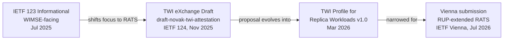

The first IETF deliverable from the SIG. An *informational* draft for the **IETF 123 meeting in Madrid (July 2025)**, scoped tightly to WIMSE-relevant statements about TWI[^recap].

## Quick facts

| | |
|---|---|
| **Type** | IETF informational Internet-Draft |
| **Target meeting** | IETF 123 — Madrid, July 2025 |
| **Repository** | `github.com/confidential-computing/twi-wimse` |
| **Submitter** | [Henk Birkholz](../people/henk-birkholz.md) (volunteered)[^submit] |
| **Final review window** | end-of-day Thursday, ~3 Jul 2025[^finishline] |

[^recap]: [113926112-twi-vs-wimse-recap.md](../../threads/113926112-twi-vs-wimse-recap.md)
[^submit]: [113970559-i-d-submission.md](../../threads/113970559-i-d-submission.md)
[^finishline]: [113955130-getting-the-i-d-over-the-finish-line.md](../../threads/113955130-getting-the-i-d-over-the-finish-line.md)
## What it argues

The draft's strategic position, set by Mark Novak[^pr33]:

> "The one thing we MUST get out of WIMSE is agreement at IETF 123 to invert the trust relationship between the workload and its hosting environment, where the workload does not trust the hosting environment to attest itself and instead must rely on RATS-style attestation."

That single architectural ask is the core of the draft. Anything more (full provenance treatment, deep credential-issuance machinery) was deliberately left out so the ask wouldn't be rejected on cost-of-change grounds[^pr33].

[^pr33]: [113881043-general-comment-on-pull-request-33.md](../../threads/113881043-general-comment-on-pull-request-33.md)
## Editorial discipline

Several PRs pruned scope on the way to submission:

| PR | Subject | Outcome |
|---|---|---|
| #1 | Core differences between TWI and WIMSE | Yogesh Deshpande, May 2025[^pr1] |
| #3 | Words added in response to SIG meeting | Mark Novak[^pr3] |
| #12 | (review continued in early Jun) | [^pr12] |
| #33 | Provenance reorganisation | Trimmed: definitions stayed in I-D, Provenance section moved to TWI Reference Architecture, replaced with a "compatible without changes" generic statement[^pr33] |
| #34 | Security Considerations | Mark Novak; pending review at finish-line[^finishline] |
| #39 | Capitalisation / grammar nits | Mark Novak[^prupdates] |

[^pr1]: [113075755-twi-wimse-pr-1.md](../../threads/113075755-twi-wimse-pr-1.md)
[^pr3]: [113098918-please-review-pull-request-3.md](../../threads/113098918-please-review-pull-request-3.md)
[^pr12]: [113383233-continue-review-of-pr-12-and-other-t-asks.md](../../threads/113383233-continue-review-of-pr-12-and-other-t-asks.md)
[^prupdates]: [113967361-new-and-updated-prs.md](../../threads/113967361-new-and-updated-prs.md)
## Relation to later drafts

After IETF 123, focus shifted to RATS for credential-issuance work[^recap].

## See also

- [TWI eXchange Draft](twi-exchange-draft.md) — the IETF 124 follow-on
- [WIMSE & TWI](../../concepts/wimse-and-twi.md)
- [github-repos](../repos/github-repos.md) — the `twi-wimse` repo lives there
