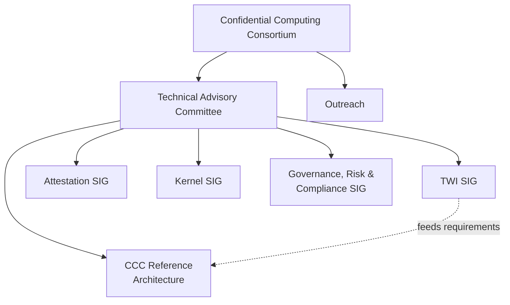

The **Confidential Computing Consortium** is the parent organisation for the TWI SIG. The SIG was originally a project track inside the CCC's governance structure, then graduated to its own mailing list at the start of April 2025 (the first message in this archive is Dan Middleton announcing "moving the conversation over to our shiny new mail list")[^firstpost].

[^firstpost]: [112008953-fw-twi-request-from-outreach-secure-s-w-supply-chain-referen.md](../../threads/112008953-fw-twi-request-from-outreach-secure-s-w-supply-chain-referen.md)
## How the SIG fits into the CCC

## Key interactions

| Body | What the SIG does there |
|---|---|
| **CCC TAC** | Reports milestones; presented v1.0 of the Replica Workloads profile on 2026-04-16 (Mark Novak, 15-min slot)[^tac]. Dan Middleton chairs the TAC. |
| **CCC Attestation SIG** | Cross-posts of attestation drafts (Composite Attesters, AR4SI, CMW)[^cmw][^ar4si]. Mark Novak presented Replica Workloads to the Attestation SIG on 2026-04-21[^attsig]. |
| **CCC Kernel SIG** | Mentioned as a contributor to a "secure coding" CCC document the SIG advocated for[^seccoding]. |
| **CCC GRC SIG** | Working with UK ICO, CSA (CCM v4.1, CEK-03) on data-in-use protection scoping[^enterprise]. |
| **CCC Outreach** | Asked the SIG (Mar 2025) for citable references linking CC with software-supply-chain security for the CC Wikipedia article[^firstpost]. |
| **CCC Governance repo** | TWI Definitions were extracted from the SIG charter via PR #325[^defs]. |

[^tac]: [118843190-please-review-tomorrow-39-s-draft-presentation.md](../../threads/118843190-please-review-tomorrow-39-s-draft-presentation.md)
[^cmw]: [114663896-conceptual-message-wrapper-cmw-ietf-draft-from-rats.md](../../threads/114663896-conceptual-message-wrapper-cmw-ietf-draft-from-rats.md)
[^ar4si]: [114723280-ar4si-draft-from-rats.md](../../threads/114723280-ar4si-draft-from-rats.md)
[^attsig]: [118956224-fw-ccc-attestation-documents-from-today-39-s-presentation.md](../../threads/118956224-fw-ccc-attestation-documents-from-today-39-s-presentation.md)
[^seccoding]: [113161461-ccc-tac-secure-coding-and-workload-administration-guidelines.md](../../threads/113161461-ccc-tac-secure-coding-and-workload-administration-guidelines.md)
[^enterprise]: [114798382-sharing-an-email-thread-concerning-the-twi-enterprise-case-d.md](../../threads/114798382-sharing-an-email-thread-concerning-the-twi-enterprise-case-d.md)
[^defs]: [115172041-two-pull-requests-around-twi-definitions.md](../../threads/115172041-two-pull-requests-around-twi-definitions.md)
## CCC Reference Architecture

The TWI SIG's Reference Architecture work feeds into the broader CCC Reference Architecture. The relationship between the two — and Hushmesh's Mesh blueprint feeding both — was the topic of a dedicated 2025-09-02 meeting[^mesh].

[^mesh]: [115008881-twi-reference-architecture-lt-gt-mesh-blueprint.md](../../threads/115008881-twi-reference-architecture-lt-gt-mesh-blueprint.md)
## Meetings

The SIG meets weekly on **Tuesdays, 6 AM Pacific** via Zoom (Linux Foundation hosting)[^horiz]. Meeting agendas drive the bulk of the mailing-list traffic; meeting minutes appear sporadically (one such update on 2025-04-08[^minutes]).

[^horiz]: [117140104-trustworthy-workload-identity-for-horizontally-scaling-workl.md](../../threads/117140104-trustworthy-workload-identity-for-horizontally-scaling-workl.md)
[^minutes]: [112162988-meeting-minutes-updated-for-april-8-2025.md](../../threads/112162988-meeting-minutes-updated-for-april-8-2025.md)