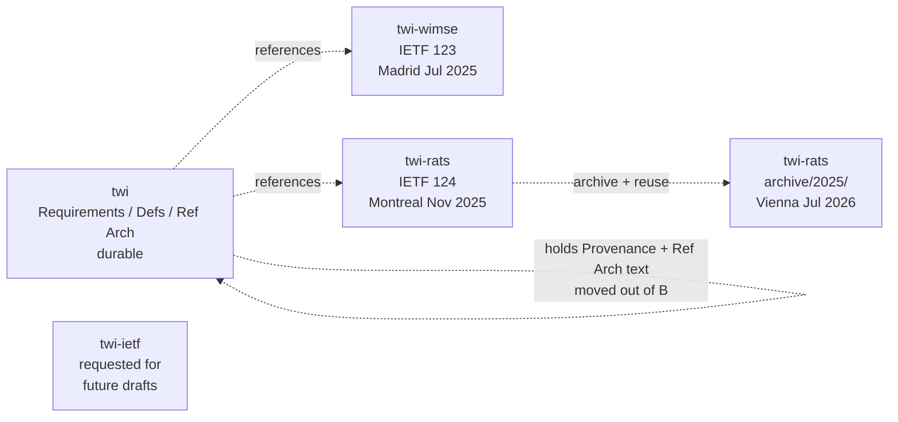

The TWI SIG works in the open on GitHub under the `confidential-computing` org. New repos are requested per IETF venue because draft repos are tied to specific submissions and cannot be reused after a draft stops moving forward.

## Repository inventory

| Repo | Purpose | First seen | Status |
|---|---|---|---|
| [`confidential-computing/twi`](https://github.com/confidential-computing/twi) | Canonical home: TWI Requirements (`TWI_Requirements.md`), Definitions, Reference Architecture | 2025-04-24 (replaced Yogesh's personal repo)[^repo1] | Active — the durable repo |
| [`confidential-computing/twi-wimse`](https://github.com/confidential-computing/twi-wimse) | IETF 123 (Madrid) Informational Draft | May 2025[^pr1] | Frozen after Madrid; PRs #1, #3, #12, #33, #34, #39 |
| [`confidential-computing/twi-rats`](https://github.com/confidential-computing/twi-rats) | IETF 124 TWI eXchange draft + Vienna submission (previous draft moved to `archive/2025/`) | Oct 2025[^firstdraft]; reused Apr 2026[^repo] | Active — Vienna draft authoring |
| `confidential-computing/twi-ietf` (requested) | "Future drafts" so the SIG doesn't need a fresh repo for every IETF venue | Requested 2026-04-22 from Riaan[^newrepo] | Created on demand; Vienna ended up reusing `twi-rats` |
| [`confidential-computing/governance`](https://github.com/confidential-computing/governance) | CCC TAC governance — TWI Definitions were pulled out of the SIG charter here | Sep 2025[^defs] | TAC-owned |

[^repo1]: [112436186-twi-repository-for-ietf-internet-draft.md](../../threads/112436186-twi-repository-for-ietf-internet-draft.md)
[^pr1]: [113075755-twi-wimse-pr-1.md](../../threads/113075755-twi-wimse-pr-1.md)
[^firstdraft]: [115689796-first-draft-of-twi-exchange-draft-ready-for-review.md](../../threads/115689796-first-draft-of-twi-exchange-draft-ready-for-review.md)
[^repo]: [118988634-repository-for-vienna-ietf-submission.md](../../threads/118988634-repository-for-vienna-ietf-submission.md)
[^newrepo]: [118959565-new-github-repo-request-for-twi-sig.md](../../threads/118959565-new-github-repo-request-for-twi-sig.md)
[^defs]: [115172041-two-pull-requests-around-twi-definitions.md](../../threads/115172041-two-pull-requests-around-twi-definitions.md)
## Repo lifecycle pattern

The pattern is: durable content lives in `twi`; per-IETF-venue submission repos hold the I-D text. After the venue, that repo's draft is either folded forward or archived.

## Key files

- `confidential-computing/twi/TWI_Requirements.md` — the official TWI Requirements text. Moved into GitHub from earlier scratch documents on 2025-05-12[^reqs].
- `confidential-computing/twi/pull/7` — the new TWI Definitions document (Definitions extracted from the SIG Charter).[^defs]
- `confidential-computing/governance/pull/325` — corresponding charter change removing the Definitions inline.[^defs]
- `confidential-computing/twi-rats/blob/main/draft-novak-twi-attestation.md` — the IETF 124 TWI eXchange draft.[^firstdraft]
- `confidential-computing/twi-rats/archive/2025/` — frozen IETF 124 draft tree (post-Vienna repo reuse).[^repo]

[^reqs]: [113075164-twi-requirements-now-in-github.md](../../threads/113075164-twi-requirements-now-in-github.md)
## Other GitHub references

External repos the SIG tracks:

- `spiffe/spiffe/issues/355` — SPIFFE **agentless mode** proposal (under review Apr 2026)[^spiffe].
- `spiffe/spiffe/issues/313` — SPIFFE **brokered mode** proposal[^spiffe].
- `nedmsmith/draft-klspa-wimse-verifiable-geo-fence` — WIMSE geo-fence draft[^geofence].
- `attest-framework` — "Attest LLM" framework[^attllm].
- `modelcontextprotocol/modelcontextprotocol/issues/1415` — MCP HTTP message-signing proposal Mark forwarded to the Attestation SIG[^mcp].

[^spiffe]: [119049410-brokered-and-agentless-modes-for-spiffe.md](../../threads/119049410-brokered-and-agentless-modes-for-spiffe.md)
[^geofence]: [113801931-agenda-for-tuesday-june-24-2025.md](../../threads/113801931-agenda-for-tuesday-june-24-2025.md)
[^attllm]: [118314175-quot-attest-llm-quot-framework.md](../../threads/118314175-quot-attest-llm-quot-framework.md)
[^mcp]: [115127912-fw-mcp-binding-could-be-improved-with-confidential-computing.md](../../threads/115127912-fw-mcp-binding-could-be-improved-with-confidential-computing.md)
## See also

- [TWI Informational Draft (IETF 123)](../drafts/informational-draft-ietf-123.md)
- [TWI eXchange Draft](../drafts/twi-exchange-draft.md)
- [Vienna submission](../drafts/vienna-submission.md)
