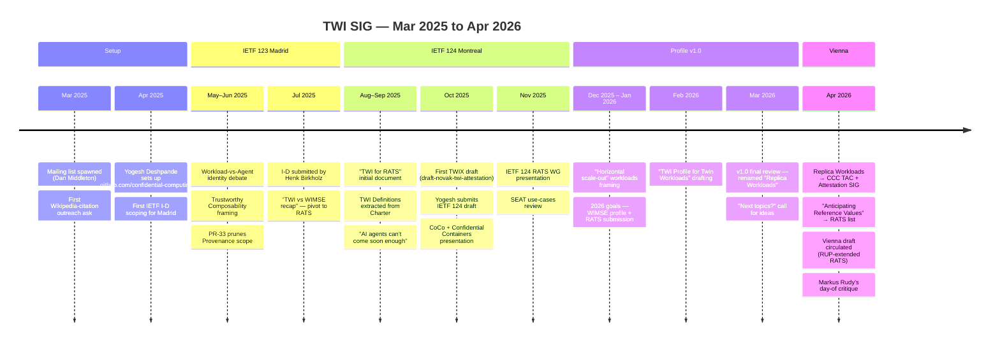

Thirteen months of work, three IETF venues, one v1.0 profile, and one architectural debate that runs from May 2025 ("Trustworthy Composability") to April 2026 (the Vienna draft).

## March 2025 — origins

The first message in the archive — *"Moving the conversation over to our shiny new mail list"* (Dan Middleton, 2025-03-31) — relays a CCC Outreach request: find citable references linking Confidential Computing with software supply chain security, for the CC Wikipedia article. The seed is provenance, even before TWI has its own architecture[^firstpost].

[^firstpost]: [112008953-fw-twi-request-from-outreach-secure-s-w-supply-chain-referen.md](threads/112008953-fw-twi-request-from-outreach-secure-s-w-supply-chain-referen.md)
## April–May 2025 — repository, requirements, first PRs

- **2025-04-24** — Yogesh Deshpande sets up `github.com/confidential-computing/twi`, asks for GitHub IDs for collaborator access[^repo1].
- **2025-05-06** — TWI logo selection (Mainsail Industries / Eric Wolfe involved).
- **2025-05-10** — Mark forwards the Attestation SIG digest, including Thomas Fossati's *Composite Attesters doc*[^cmwfwd].
- **2025-05-11/12** — *Workload Identity vs. Agent Identity* — Manu Fontaine kicks off the long-running debate about exclusivity, delegation, and per-entity keychains[^wivai].
- **2025-05-12** — TWI Requirements moved into GitHub as the canonical reference[^reqs]; Yogesh's PR #1 enumerates TWI vs WIMSE differences[^pr1].
- **2025-05-13** — PR #3 against `twi-wimse`[^pr3].
- **2025-05-17** — Manu's secure-coding / "Agentic DID" thread, citing the Grok unauthorised-modification incident[^seccoding].
- **2025-05-27** — *Trustworthy Composability* — Manu's bullet-point manifesto sent to David Quigley and forwarded to the SIG[^tc].

[^repo1]: [112436186-twi-repository-for-ietf-internet-draft.md](threads/112436186-twi-repository-for-ietf-internet-draft.md)
[^cmwfwd]: [113039986-fw-ccc-attestation-tech-attestation-digest-28.md](threads/113039986-fw-ccc-attestation-tech-attestation-digest-28.md)
[^wivai]: [113061126-workload-identity-vs-agent-identity.md](threads/113061126-workload-identity-vs-agent-identity.md)
[^reqs]: [113075164-twi-requirements-now-in-github.md](threads/113075164-twi-requirements-now-in-github.md)
[^pr1]: [113075755-twi-wimse-pr-1.md](threads/113075755-twi-wimse-pr-1.md)
[^pr3]: [113098918-please-review-pull-request-3.md](threads/113098918-please-review-pull-request-3.md)
[^seccoding]: [113161461-ccc-tac-secure-coding-and-workload-administration-guidelines.md](threads/113161461-ccc-tac-secure-coding-and-workload-administration-guidelines.md)
[^tc]: [113326321-trustworthy-composability.md](threads/113326321-trustworthy-composability.md)
## June 2025 — provenance scoping

- **2025-06-24** — Mark queues `draft-klspa-wimse-verifiable-geo-fence` and OpenSSF Model Signing for review[^geofence].
- **2025-06-28/29** — *PR #33 review* — Mark and Mateusz Bronk align on dropping deep provenance text from the IETF 123 ID; provenance moves to the TWI Reference Architecture[^pr33].

[^geofence]: [113801931-agenda-for-tuesday-june-24-2025.md](threads/113801931-agenda-for-tuesday-june-24-2025.md)
[^pr33]: [113881043-general-comment-on-pull-request-33.md](threads/113881043-general-comment-on-pull-request-33.md)
## July 2025 — IETF 123 Madrid

- **2025-07-01** — *TWI vs WIMSE — recap*. Mark's line-by-line audit. **Pivot:** "after Madrid we should focus most of our attention on [RATS]"[^recap].
- **2025-07-02/03** — Final-PR push, `getting the I-D over the finish line`[^finishline].
- **2025-07-03** — Mark asks for a submission volunteer; **Henk Birkholz** raises his hand (2025-07-04)[^submit].
- **2025-07-10/15** — *Composability and strength of "Couplings"* — Manu and Mark stake out the deployability vs. North Star positions that will recur for the next year[^couplings].

[^recap]: [113926112-twi-vs-wimse-recap.md](threads/113926112-twi-vs-wimse-recap.md)
[^finishline]: [113955130-getting-the-i-d-over-the-finish-line.md](threads/113955130-getting-the-i-d-over-the-finish-line.md)
[^submit]: [113970559-i-d-submission.md](threads/113970559-i-d-submission.md)
[^couplings]: [114091547-thoughts-about-quot-composability-quot-and-strength-of-quot.md](threads/114091547-thoughts-about-quot-composability-quot-and-strength-of-quot.md)
## August–September 2025 — pivot to RATS, definitions split

- **2025-08-12** — *TWI Business Use Case* (Mark) and *Conceptual Message Wrapper (CMW)* forwarded from RATS[^cmw].
- **2025-08-15** — `draft-ietf-rats-ar4si` flagged for review[^ar4si].
- **2025-09-02** — Manu presents the **Mesh blueprint** as input to the CCC Reference Architecture[^mesh].
- **2025-09-03** — *TWI for RATS — initial document* (the seed of what becomes the TWIX draft)[^twiforrats].
- **2025-09-06** — *Workload identity for AI agents can't come soon enough* — the ChatGPT/LinkedIn case study[^chatgptlinkedin].
- **2025-09-08** — MCP binding could be improved with CC, cross-posted with the Attestation SIG[^mcp].
- **2025-09-10** — TWI **Definitions** extracted from the SIG Charter into their own doc; corresponding governance PR #325[^defs].
- **2025-09-12** — IETF 124 informational-draft scoping[^id124].

[^cmw]: [114663896-conceptual-message-wrapper-cmw-ietf-draft-from-rats.md](threads/114663896-conceptual-message-wrapper-cmw-ietf-draft-from-rats.md)
[^ar4si]: [114723280-ar4si-draft-from-rats.md](threads/114723280-ar4si-draft-from-rats.md)
[^mesh]: [115008881-twi-reference-architecture-lt-gt-mesh-blueprint.md](threads/115008881-twi-reference-architecture-lt-gt-mesh-blueprint.md)
[^twiforrats]: [115048575-twi-for-rats-initial-document.md](threads/115048575-twi-for-rats-initial-document.md)
[^chatgptlinkedin]: [115104223-workload-identity-for-ai-agents-can-t-come-soon-enough.md](threads/115104223-workload-identity-for-ai-agents-can-t-come-soon-enough.md)
[^mcp]: [115127912-fw-mcp-binding-could-be-improved-with-confidential-computing.md](threads/115127912-fw-mcp-binding-could-be-improved-with-confidential-computing.md)
[^defs]: [115172041-two-pull-requests-around-twi-definitions.md](threads/115172041-two-pull-requests-around-twi-definitions.md)
[^id124]: [115209132-informational-draft-for-ietf-124.md](threads/115209132-informational-draft-for-ietf-124.md)
## October–November 2025 — TWIX draft and IETF 124 Montreal

- **2025-10-01** — *Help needed editing the TWIX draft*[^twix].
- **2025-10-02** — Mark presents to Confidential Containers (Sam Ortiz)[^cocopres].
- **2025-10-10** — First TWIX draft ready: `confidential-computing/twi-rats/blob/main/draft-novak-twi-attestation.md`[^firstdraft].
- **2025-10-17** — *Putting finishing touches…* — Yogesh volunteers to submit on Monday 2025-10-19/20[^finishing].
- **2025-10-22** — Yogesh forwards `draft-ni-wimse-ai-agent-identity` (FYI: WIMSE for AI Agents)[^aiagent].
- **2025-10-31 / 11-04 / 11-07** — IETF 124 final-draft presentation, SEAT use-cases comment, RATS WG presentation[^pres][^seat].

[^twix]: [115537750-help-needed-editing-the-twix-draft.md](threads/115537750-help-needed-editing-the-twix-draft.md)
[^cocopres]: [115554186-twi-presentation-this-morning.md](threads/115554186-twi-presentation-this-morning.md)
[^firstdraft]: [115689796-first-draft-of-twi-exchange-draft-ready-for-review.md](threads/115689796-first-draft-of-twi-exchange-draft-ready-for-review.md)
[^finishing]: [115809076-putting-finishing-touches-on-our-ietf-submission.md](threads/115809076-putting-finishing-touches-on-our-ietf-submission.md)
[^aiagent]: [115889621-fyi-workload-identity-for-ai-agents.md](threads/115889621-fyi-workload-identity-for-ai-agents.md)
[^pres]: [116048814-ietf-124-presentation-final-draft.md](threads/116048814-ietf-124-presentation-final-draft.md)
[^seat]: [116109344-mail-regarding-draft-mihalcea-seat-use-cases-one-key-quot-in.md](threads/116109344-mail-regarding-draft-mihalcea-seat-use-cases-one-key-quot-in.md)
## December 2025 – January 2026 — replanning

- **2025-12-09** — Reference-Architecture TODO close-out; Manu raises *chains of relying parties* and "verifiers of verifiers"[^chains].
- **2026-01-07** — *Trustworthy Workload Identity for horizontally scaling workloads* — 2026 plan: WIMSE profile (interim) + RATS submission for Shenzhen, plus a CCC implementation PoC (Trustee mentioned)[^horiz].
- **2026-01-20** — WIMSE thread on early routing vs identity in mTLS forwarded for awareness[^early].

[^chains]: [116689050-agenda-for-tuesday-9-november-2025.md](threads/116689050-agenda-for-tuesday-9-november-2025.md)
[^horiz]: [117140104-trustworthy-workload-identity-for-horizontally-scaling-workl.md](threads/117140104-trustworthy-workload-identity-for-horizontally-scaling-workl.md)
[^early]: [117367917-fw-wimse-re-problem-statement-early-routing-vs-workload-iden.md](threads/117367917-fw-wimse-re-problem-statement-early-routing-vs-workload-iden.md)
## February–March 2026 — Twin → Replica Workloads

- **2026-02 / early Mar** — TWI Profile for **Twin Workloads** drafted; final review on **2026-03-03**[^twin].
- **2026-03-03** — *Next topics for TWI SIG* — call for ideas[^next].
- **2026-03-31** — Profile renamed **Replica Workloads** v1.0; Mark approaches Dan Middleton about a CCC TAC presentation[^replica]. Henk briefed about getting it in front of RATS for Vienna[^replicarats].

[^twin]: [118116641-final-review-twi-profile-for-twin-workloads.md](threads/118116641-final-review-twi-profile-for-twin-workloads.md)
[^next]: [118116751-next-topics-for-twi-sig.md](threads/118116751-next-topics-for-twi-sig.md)
[^replica]: [118596716-trustworthy-workload-identity-for-replica-workloads.md](threads/118596716-trustworthy-workload-identity-for-replica-workloads.md)
[^replicarats]: [118596984-twi-profile-for-replica-workloads-and-the-ietf-rats.md](threads/118596984-twi-profile-for-replica-workloads-and-the-ietf-rats.md)
## April 2026 — Vienna draft

- **2026-04-01** — Manu opens the *Provenance / mesh of workloads* thread (triggered by Abdullah)[^prov].
- **2026-04-15** — Mark sends *Anticipating Reference Values* to the RATS list[^antrv]; Replica Workloads presentation deck shared for review[^tac].
- **2026-04-16** — Replica Workloads v1.0 presented to the CCC TAC.
- **2026-04-21/22** — Same presentation to the CCC Attestation SIG; Mark articulates the dual options for RP stability[^attsig].
- **2026-04-22** — Request for `confidential-computing/twi-ietf` repo[^newrepo].
- **2026-04-24** — Vienna draft circulated; Markus Rudy's critique on the same day[^vienna].
- **2026-04-28** — *Brokered and agentless modes for SPIFFE* — proposals queued for SIG review[^spiffe].

## May–June 2026 — Impossibility papers and Vienna sprint

- **2026-05-12/13** — Mark Novak circulates two **impossibility papers**, cross-posted to the CCC Attestation SIG[^impossibility]: (1) proof that RATS-unaware RPs cannot be handled within the RATS architecture proper; (2) proof that such RPs are unavoidable in practice. Together these provide the formal foundation for the Vienna extension.
- **2026-06-01** — Three competing draft directions identified[^jun2]: the TWI SIG replica-workload draft (primary), Michael Richardson's `mcr/twi-rats` (passport + background-check models borrowed), and the CCC TAC "Identity Bridge" blueprint (bearer-token emphasis). Mark introduces the **Credential Broker / Key Broker** role and proposes short-term convergence on direction (1).
- **2026-06-09** — Protocol variants documented in table form; SIG seeks a RATS session slot at Vienna IETF[^jun9].
- **2026-06-16** — Meeting cancelled — insufficient confirmed attendance[^cancelled].
- **2026-06-25** — Submission deadline: Mark goes offline (returns Jul 6); will present in Vienna in person.
- **2026-06-30** — No TWI SIG meeting this week[^nomtg].

[^impossibility]: [119273859-impossibility-of-rats-unaware-relying-parties-in-the-rats-ar.md](threads/119273859-impossibility-of-rats-unaware-relying-parties-in-the-rats-ar.md)
[^jun2]: [119596145-agenda-for-tuesday-june-2-2026.md](threads/119596145-agenda-for-tuesday-june-2-2026.md)
[^jun9]: [119717344-agenda-for-tuesday-june-9-2026.md](threads/119717344-agenda-for-tuesday-june-9-2026.md)
[^cancelled]: [119827237-meeting-tomorrow-cancelled.md](threads/119827237-meeting-tomorrow-cancelled.md)
[^nomtg]: [120041110-no-meeting-this-week-lt-eom-gt.md](threads/120041110-no-meeting-this-week-lt-eom-gt.md)

[^prov]: [118625119-let-39-s-discuss-provenance.md](threads/118625119-let-39-s-discuss-provenance.md)
[^antrv]: [118845083-fw-anticipating-reference-values.md](threads/118845083-fw-anticipating-reference-values.md)
[^tac]: [118843190-please-review-tomorrow-39-s-draft-presentation.md](threads/118843190-please-review-tomorrow-39-s-draft-presentation.md)
[^attsig]: [118956224-fw-ccc-attestation-documents-from-today-39-s-presentation.md](threads/118956224-fw-ccc-attestation-documents-from-today-39-s-presentation.md)
[^newrepo]: [118959565-new-github-repo-request-for-twi-sig.md](threads/118959565-new-github-repo-request-for-twi-sig.md)
[^vienna]: [118990275-early-draft-of-the-vienna-submission.md](threads/118990275-early-draft-of-the-vienna-submission.md)
[^spiffe]: [119049410-brokered-and-agentless-modes-for-spiffe.md](threads/119049410-brokered-and-agentless-modes-for-spiffe.md)
## See also

- [Overview](overview.md)
- [Log](log.md)
